## <span style="color: rgb(255, 76, 65);">Resources</span>

Download code, libraries and more details, please refer to the following link: [https://fs.keyestudio.com/KS0505-0506](https://fs.keyestudio.com/KS0505-0506)

# KS0505 Keyestudio STEM Starter Kit with plus board

## **1. Introduction**

Do you want to acquire programming knowledge? As long as you are passionate about science and dare to explore new things, this STEM starter kit must be your best choice.

KEYESTUDIO STEM Starter Kit is a programming learning kit based on Arduino. With a controller, numerous sensors, modules and electronic components, you can do many different DIY projects.

This kit also comes with 28 projects tutorials, which are entirely suitable for beginners. Each tutorial has detailed wiring diagrams and fascinating Project Codes. You can learn electronics, physics, science and programming knowledge.


## **2. Part List**

|        | 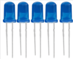| 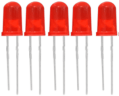                  | 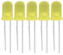                   |         | 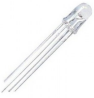                                                                     |
|--------------------------------------------------------------------------------------|-------------------------------------------------------------------------------------------|-------------------------------------------------------------------------------------------|-------------------------------------------------------------------------------------------|--------------------------------------------------------------------------------------|---------------------------------------------------------------------------------------------------------------------------------------------------|
| Plus board\*1                                                                        | LED - Blue\*5                                                                             | LED - Red\*5                                                                              | LED - Yellow\*5                                                                           | LED - Green\*5                                                                       | LED - RGB\*1                                                                                                                                      |
|  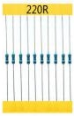       |  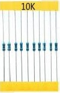     | 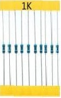      | 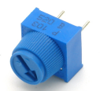 |               |                                                                             |
| 220Ω Resistor\*10                                                                    | 10KΩ Resistor\*10                                                                         | 1KΩ Resistor\*10                                                                          | 10KΩ Potentiometer\*1                                                                     | Buzzer (Active)\*1                                                                   | Buzzer (Passive)\*1                                                                                                                               |
|  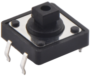                                 |  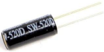                       |        |              |  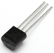  |  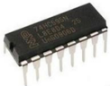                                                                           |
| Button Switch\*4                                                                     | Ball Tilt Sensor\*2                                                                       | Photo Cell\*3                                                                             |  Flame Sensor\*1                                                                          | LM35 Temp Sensor\*1                                                                  | IC 74HC595N \*1                                                                                                                                   |
|  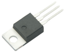              |        | 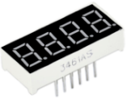        |  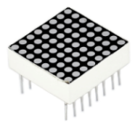      |              |                                                                         |
| TIP122 Transistor\*1                                                                 | 1 Digital Tube Display\*1                                                                 | 4 Digital Tube Display\*1                                                                 | 8\*8 LED Matrix\*1                                                                        | 1602 I2C LCD \*1                                                                     | IR Receiver\*1                                                                                                                                    |
|  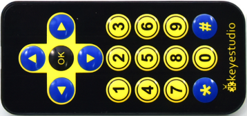                                  |             | 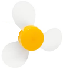          |              |                |  |
| IR Remote Control\*1                                                                 | Servo Motor\*1                                                                            | 130 Motor Propeller\*1                                                                    | 130 Dc Motor\*1                                                                           | Stepper Driver\*1                                                                    | Stepper Motor\*1                                                                                                                                  |
|                            |       |                 |             |            |                                                                       |
| Joystick Module\*1                                                                   | Sound Sensor\*1                                                                           | PIR Motion Sensor\*1                                                                      | HC-SR04 Ultrasonic\*1                                                                     | DHT11 Sensor\*1                                                                      | 400-hole Breadboard\*1                                                                                                                            |
|              |  | 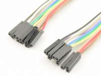 | 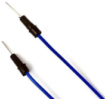             |         | 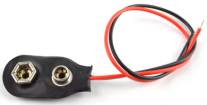                                                                            |
| Plus board holder\*1                                                                    | Male to Female Dupont Wire\*10                                                            | Female to Female Dupont Wire\*10                                                          | Flexible jumper Wire\*20                                                                  | Preformed Jumper Wire\*1                                                             | 9v Battery Connector\*1                                                                                                                           |
|   |                         | 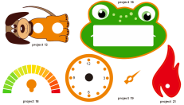                  | 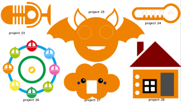            |            |                                                                                                                                                   |
| Type c USB Cable\*1                                                                  | Cartoon paper                                                                             | Cartoon paper                                                                             | Cartoon paper                                                                             | Resistor card                                                                        |                                                                                                                                                   |

## **3. KEYESTUDIO Plus Development Board**

Before we get started with the KEYESTUDIO STEM Starter Kit, we first introduce the Plus Development Board, it is the core of all the projects.

KEYESTUDIO Plus Development Board is fully compatible with Arduino and contains all the functions of the Arduino UNO R3, but it is more powerful than the Arduino UNO R3. It is the best choice to learn how to build circuits and design your own code. Let us get more detailed information about it.


Serial communication interface: D0 is RX, D1 is TX

PWM interface (pulse width modulation): D3 D5 D6 D9 D10 D11

External interrupt interface: D2 (interrupt 0) and D3 (interrupt 1)

SPI communication interface: D10 is SS, D11 is MOSI, D12 is MISO, D13 is SCK

IIC communication port: A4 is SDA, A5 is SCL

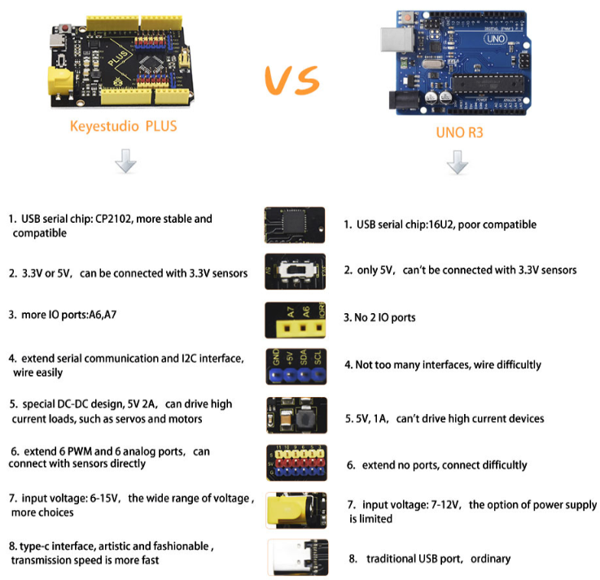

## **4. Installing Driver for Windows**


**4.1 Download Software**

Arduino IDE is the open-source Software makes it easy to write code and upload it to the board. When getting the control board, we first need to install Arduino IDE

Go to the website [https://www.arduino.cc/](https://www.arduino.cc/) and you will see the following page.

Clickand


Then you will see a page where you can download the latest version of the IDE. There are the Installer (.exe) and the Zip packages you can choose for Windows. We suggest you use the first one that installs directly everything you need to use the Arduino Software (IDE), including the drivers. With the Zip package you need to install the drivers manually. The Zip file is also useful if you want to create a portable installation.


Pull down this page, you can also click "previous version of the current release" to enter another page to select and install the previous version of Arduino Software.

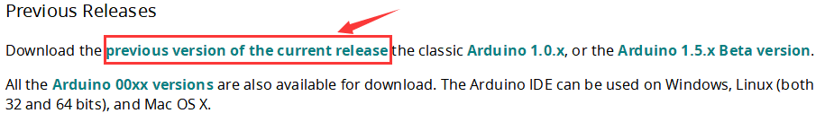

In this project, we choose Installer (.exe) for Windows.

Click Windows Win 7 and newer and JUST DOWNLOAD.


The download file: 

Double-click the arduino IDE (.exe) file

Choose "I Agree" to see the following interface.

Choose "Next" to see the following interface.

Press "Install" to initiate installation.


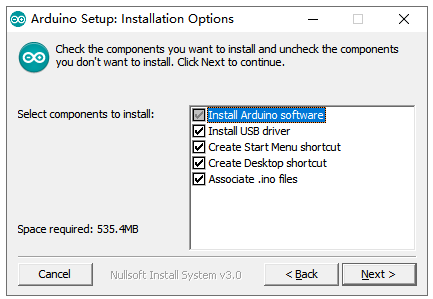

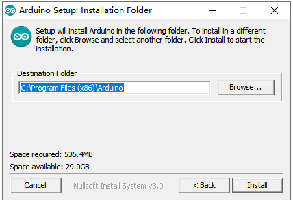

If the following interface appears, you should choose “Install”.


**4.2 Installing Driver on Windows**

Before using the KEYESTUDUO Plus Control Board, you must install the driver of it, otherwise it will not communicate with computer.

Unlike the USB series chip (ATMEGA8U2) of the Arduino UNO R3, the KEYESTUDIO Plus Development Board is used the CP2102 chip USB series chip and USB type C interface.

The driver of the CP2102 chip is included in 1.8.0 version and newer version of Arduino IDE. Usually, you connect the board to the computer and wait for Windows to begin its driver installation process. After a few moments, the process will succeed.

If the driver installation process fail, you need to install the driver manually.

Note:

1. Please make sure that your IDE is updated to 1.8.0 or newer version

2. If the version of Arduino IDE you download is below 1.8, you should download the driver of CP2102 and install it manually.

Link to download the driver of CP2102:

[https://fs.keyestudio.com/CP2102-WIN](https://fs.keyestudio.com/CP2102-WIN)

To install the drive manually, open the device manager of computer.

Right click Computer----- Click Properties-----Click Device Manager.

Look under Ports (COM & LPT) or other device.

A yellow exclamation mark means that the CP2102 driver installation failed.


Double-click the font with yellow exclamation mark and clich “OK”

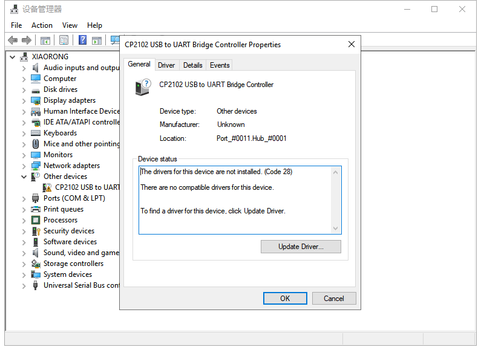

Click “browse my computer for updated driver software”.


Navigate to the "Drivers" folder of the Arduino Software you have download and click “Next” to install the drive.

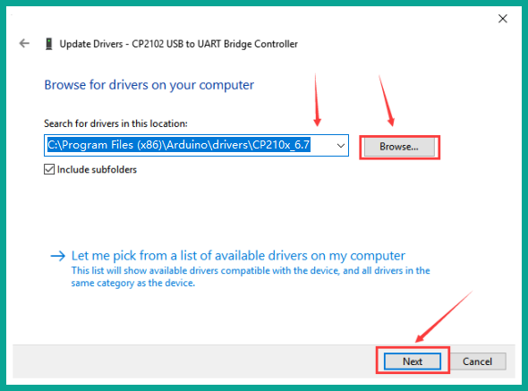

The driver is installed successfully.


Open device manager, we will find the yellow exclamation mark disappear. The driver of CP2102 is installed successfully.


**4.3 Configure Arduino IDE**

After the driver is successfully installed, it’s time to configure the IDE to use the same device and port to start uploading code.

For the KEYESTUDIO Plus Control Board, we should navigate to Tools \> Board \> and select Arduino Uno(as shown below). However, if you are using a different board (i.e., not the Arduino Uno or KEYESTUDIO Plus Control Board), you must select the proper board!


Then select the correct COM port.

You can see the corresponding COM port after the driver is successfully installed.


Navigate to Tools \> Port \>COM7

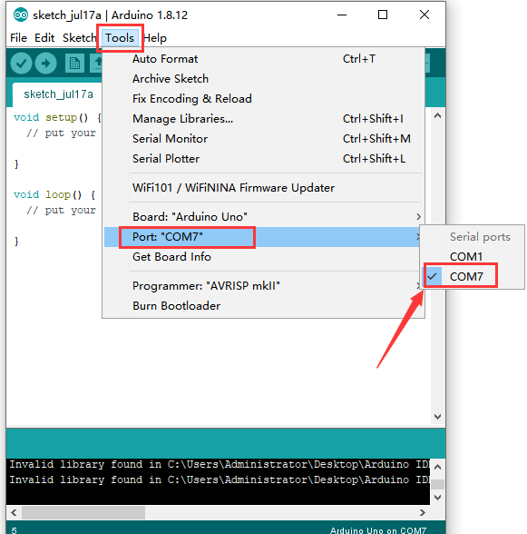

The function of each symbol in the Arduino IDE toolbar.


A- verify whether there is any compiling mistakes or not.

B- upload the sketch to your Arduino board.

C- create shortcut window of a new sketch.

D- directly open an example sketch.

E- save the sketch.

F- send the serial data received from board to the serial monitor.

4.4 Start First Program

Click File -\> Examples -\> 01.Basics -\>Blink

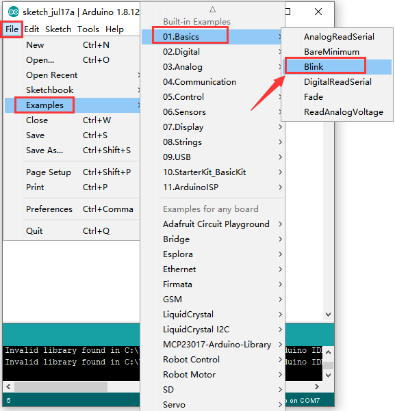

When the sketch window opens, you can see the entire sketch in the window.


Choose the correct board type and COM port

Clickto upload the code.

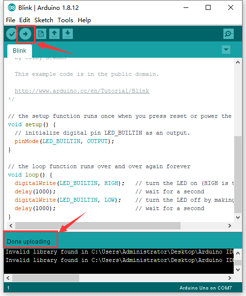

Dode uploarding!

The onboard LED lights on for 1s, lights off for 1s.

Congratulation, you finish the first program.

## **5. Installing Driver on MAC**


5.1 Download Software

Click and download Arduino IDE for MAC system :


5.2 Download the Driver of CP2102

[https://fs.keyestudio.com/CP2102-MAC](https://fs.keyestudio.com/CP2102-MAC)

5.3 How to Install the Driver of CP2102

Connect the Plus development board to your computer, and open Arduino IDE


Click Tools to configure Board and Port: Arduino Uno and /dev/cu.usbserial-0001


Tap Upload to upload code, if burn successfully, you will view done uploading.

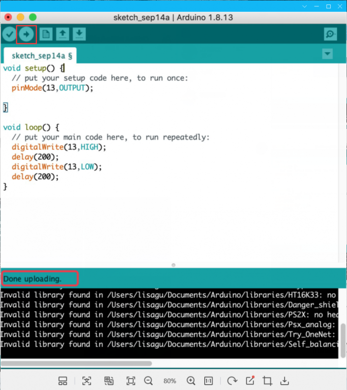

**Note: If burn unsuccessfully, you need to install driver of CP2102, please continue to follow the instructions as below:**

Download the driver of CP2102:

[https://www.silabs.com/products/development-tools/software/usb-to-uart-bridge-vcp-drivers](https://www.silabs.com/products/development-tools/software/usb-to-uart-bridge-vcp-drivers)

1.Select Mac OSX edition


2.Unzip the downloaded package


3.Open folder and double-click SiLabsUSBDriverDisk.dmg file.


4.You will view the following files as follows:


5.Double-click Install CP210x VCP Driver, tick Don’t warn me and tap Open


6.Tap Continue


7.Tap Continue and Agree


8.Click Continue and input your password


9.Select Open Security Preferences


10.Click the lock to unlock security & privacy preference.


11.Then click Allow


12.Back to installation page, and wait to install.


13.Successfully installed


14.Then enter ArduinoIDE, click Tools and select Board: Arduino Uno and /dev/cu.SLAB_USBtoUAPT


15. Click to upload code and you will see “Done uploading”.


## **6. Import Libraries**

What are Libraries ?

[Libraries](https://www.arduino.cc/en/Reference/Libraries) are a collection of code that makes it easy for you to connect to a sensor,display, module, etc.

For example, the built-in LiquidCrystal library helps talk to LCD displays. There are hundreds of additional libraries available on the Internet for download.

The built-in libraries and some of these additional libraries are listed in the reference（[https://www.arduino.cc/en/Reference/Libraries](https://www.arduino.cc/en/Reference/Libraries)）.

How to Install a Library

**6.1 Manual installation**

When you want to add a library manually, first quit the Arduino application, then you need to download library as a ZIP file, expand it and put in the proper directory.

For example, we will install the IR Remote Library which can be found on GitHub:  [https://github.com/shirriff/Arduino-IRremote](https://github.com/shirriff/Arduino-IRremote)

First, download the library as a ZIP, which is done by clicking the green “Code” button and then clicking “Download ZIP”.


Once downloaded, Unzip the the IR Remote Library package.


Then navigate to your Arduino folder.


Open the“Libraries”folder in the Arduino folder and then drag the “Arduino-IRremote-master”folder into the libraries folder.

The library file is manually installed.


**6.2 Using the Library Manager**

To install a new library into your Arduino IDE you can use the Library Manager (available from IDE version 1.6.2). Open the IDE and click to the "Sketch" menu and then Include Library \> Manage Libraries.

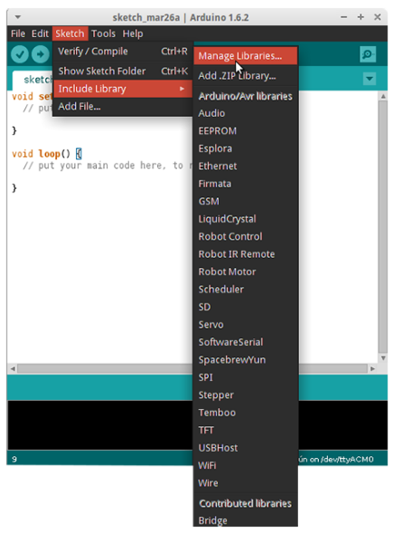

Then the Library Manager will open and you will find a list of libraries that are already installed or ready for installation. In this example we will install the Bridge library. Scroll the list to find it, click on it, then select the version of the library you want to install. Sometimes only one version of the library is available. If the version selection menu does not appear, don't worry: it is normal.


Finally click on install and wait for the IDE to install the new library. Downloading may take time depending on your connection speed. Once it has finished, an Installed tag should appear next to the Bridge library. You can close the library manager.


You can now find the new library available in the Sketch \> Include Library menu.

**6.3 Importing a .zip Library**

Open the Arduino IDE, navigate to Sketch \> Include Library. At the top of the drop down list, select the option to "Add .ZIP Library''.

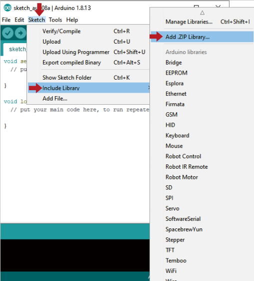

We will install the IR Remote Library which can be found on GitHub:
[https://github.com/shirriff/Arduino-IRremote](https://github.com/shirriff/Arduino-IRremote)

First, download the library as a ZIP, which is done by clicking the green “Code” button and then clicking “Download ZIP”.

Navigate to the .zip file's location and open it.

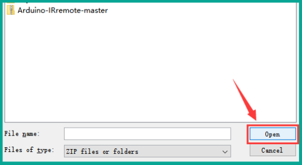

Return to the Sketch \> Import Library menu.

You should now see the library at the bottom of the drop-down menu.

## **7. Projects**

### Project 1: Hello World


**1. Project Introduction**

For Arduino starters, we will begin with something simple. In this project, you will only need a Plus development board and a USB cable to complete the "Hello World!" project. It is not only a communication test of your Arduino board and the PC, but also a primer project in the Arduino world!

**2. Project Hardware**

| 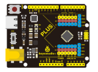 |  |  | 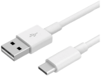 |  |
|----------------------------------------------------------------------------|--------------------------------------------------------------------------|--------------------------------------------------------------------|-------------------------------------------------------------------------------------|-----------------------------------------------------------------------------|
| Plus Board\*1                                                              | Plus Board Holder                                                             | 400-Hole Breadboard                                                | USB Cable\*1                                                                        | Hello World Card\*1                                                         |

**3. Assembly Project Platform**

Before starting the project, we will install the Plus Development Board and 400-Hole breadboard onto the board holder.

Remove the adhesive sticker of the breadboard.


Attach the breadboard to the board holder


Use three plastic columns to fix the PLUS development board on the board holder.

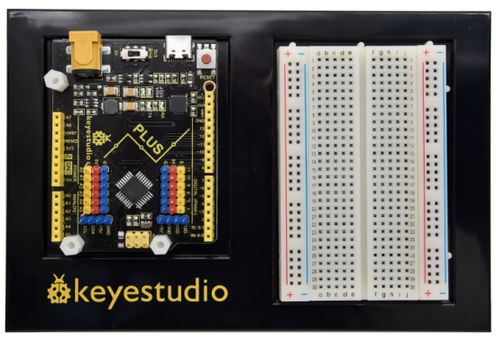

The assembly of the project platform is complete.

**4. Project Code**

A simple **If () statement** programming control structure will be used. Arduino uses a serial monitor for displaying information such as print statements, sensor data, and so on. This is a very powerful tool for debugging long codes. Now for your first code!

```c
/*
keyestudio STEM Starter Kit
Project 1
Hello World
http//www.keyestudio.com
*/
int val;//define variable val
void setup()
{
Serial.begin(9600);// set the baud rate at 9600 .   
}
void loop()
{
  val=Serial.read();// read the instruction or character from PC to Arduino, and assign them to Val.
  if(val=='R')// determine if the instruction or character received is “R”.
  {  // if it’s “R”,    
     Serial.println("Hello World!");// display“Hello World！”string.
  }}
/////////////////////////////////////////////////////////////////

```
**5. Project Result**

Double-click icon to enter serial monitor.


Every time you enter an "R" in the text box and click “send”, the onboard LED on the plus board will flash once, and the serial monitor will display a Hello World!


### Project 2: Blinking Eyes Of Dinosaur

****

**1. Project Introduction**

In this project, we will show you a dinosaur with a blinking eye.

We use the digital pin of Arduino to turn on an LED and let it blink, match with a cartoon dinosaur card we provided, the LDE will become the dinosaur's twinkling eye.

**2. Project Hardware**

|  |  |             |  |
|----------------------------------------------------------------------------------|--------------------------------------------------------------------------|-------------------------------------------------------------------------------|-------------------------------------------------------------------------------------|
| Plus Board\*1                                                                    | Plus Board holder                                                        | 400-hole Breadboard                                                           | USB cable\*1                                                                        |
| 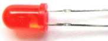     | 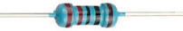                          |  |                   |
| Red M5 LED\*1                                                                    | 220Ω Resistor\*1                                                         | Jumper Wire\*2                                                                | Cartoon dinosaur Card\*1                                                            |

**3. Introduction Of Electronic Components**

**(1) LED**:


LED is a type of semiconductor called "Light Emitting Diode" which is an electronic device made of semiconductor materials (silicon, selenium, germanium,etc). It has positive and negative poles. The short leg is the negative pole to connect GND, and the long one is the positive pole to connect 5V.


 **(2) Five Band Resistor**

A resistor is an electronic component in the circuit, which limits and regulates the current flow. Its unit is (Ω).

\-Band 1 – First significant digit.

\-Band 2 – Second significant digit.

\-Band 3 – Third significant digit.

\-Band 4 – Multiplier.

\-Band 5 – Tolerance.

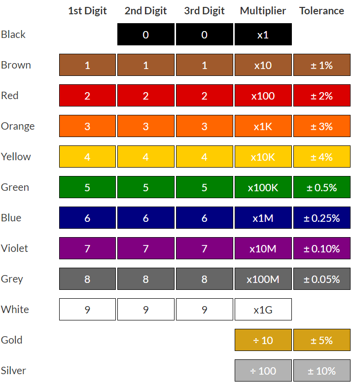

In this kit, we provide three five-band resistors with different resistance values.

220Ω Resistor\*10


10KΩ Resistor\*10


1KΩ Resistor\*10


**(3) Breadboard:**

The breadboard is used to build and test circuits quickly before finalizing any circuit design. The breadboard has many holes which circuit components like ICs and resistors can be inserted into.

A typical breadboard is shown below:


The bread board has strips of metal which run underneath the board and connect the holes on the top of the board.


The metal strips are laid out as shown below. Note that the top and bottom rows of holes are connected horizontally while the remaining holes are connected vertically.

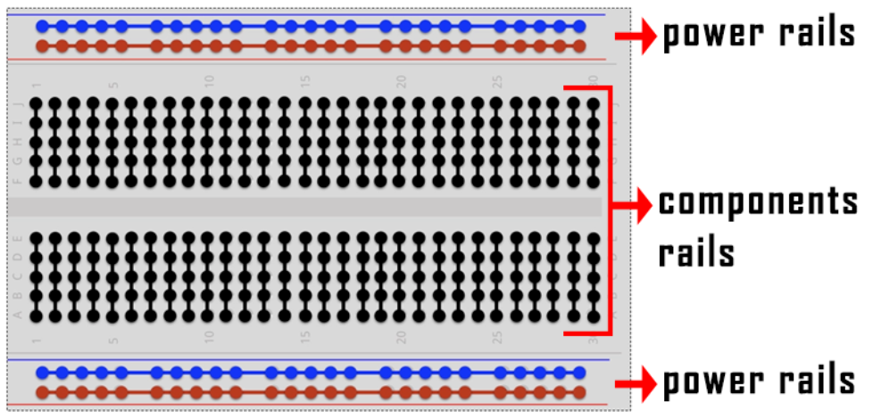

The first two rows (top) and last two rows (bottom) of the breadboard are used for positive and for negative.

The conductive layout diagram of the breadboard is shown in the figure above.

The electronics beginners may get confused while connecting the DIP (Dual In-line Packages) components such as integrated circuits, microcontrollers, chips, etc.,. The rails are isolated by ravine or crevasse, thus the rows are not connected to each other on either side. So, the DIP components can be connected as shown in the figure below.


**3. Circuit Connection**

Look at the circuit schematic and wiring diagram of the project. Here we use digital pin 10 and connect an LED to a 220 ohm resistor to avoid high current damaging the LED. 


**NOTE:**

How to connect an LED


How to identify 5 band 220Ω Resistor


**4. Project Code**

```c
/*
keyestudio STEM Starter Kit
Project 2
Dinosaur Blink Eyes
http//www.keyestudio.com
*/
int ledPin = 10; // define digital pin 10.
void setup()
{
pinMode(ledPin, OUTPUT);// define led pin as output.
}
void loop()
{
digitalWrite(ledPin, HIGH); // set the LED on.
delay(1000); // wait for a second.
digitalWrite(ledPin, LOW); // set the LED off.
delay(1000); // wait for a second
}
//////////////////////////////////////////////////////////////////
```

1. Open up the Arduino IDE and copy the below code into a new sketch.

2. Select the correct Board type and COM port for the Arduino IDE.

3. Click Upload button on Arduino IDE to upload code.

**5. Project Result**

Done uploading. The LED light connected to the D10 pin of the development board turns on and off every second.

Put the dinosaur card on the LED bulb like the picture below, and you will get a cute little dinosaur that can continue to blink its eye.


### Project 3: Little Star

****

**1. Project Introduction**

In this project, we will learn the PWM control of ARDUINO. PWM is the abbreviation of Pulse Width Modulation, which is a technology that encodes analog signal level into digital signal level.

Here, we use PWM to control the brightness of an LED from bright to dark gradually. Match our customized star card, you will get a flickering star.

**2. Project Hardware**

|  |  |  |  |
|----------------------------------------------------------------------------------|--------------------------------------------------------------------------|--------------------------------------------------------------------|-------------------------------------------------------------------------------------|
| Plus development Board\*1                                                        |  Plus Board holder                                                       | 400-hole Breadboard                                                | USB cable\*1                                                                        |
|      |                           |                     |         |
| M5 Red LED\*1                                                                    |  220Ω Resistor\*1                                                        | Jumper Wire\*2                                                     | Cartoon Little Star Card\*1                                                         |

**3. PWM Working Principle**


PWM stands for Pulse Width Modulation and it is a technique to control LED’s brightness, speed of DC motor and servo motor.

The Arduino digital pins either produces 5V (when turned HIGH) or 0V (when turned LOW). Yet, it output a square wave signal. So if we want to dim a LED, we cannot get the voltage between 0 and 5V from the digital pin but we can change the ON and OFF time of the signal. If we will change the ON and OFF time fast enough then the brightness of the led will be changed.

Before going further, let’s discuss some terms associated with PWM.

TON (On Time): It is the time when the signal is high.

TOFF (Off Time): It is the time when the signal is low.

Period: It is the sum of on time and off time.

Duty Cycle: It is the percentage of time when the signal is high during the time of period.

So at 50% duty cycle and 1Hz frequency, the led will be high for half a second and will be low for the other half second. If we increase the frequency to 50Hz (50 times ON and OFF per second), then the led will be seen glowing at half brightness by the human eye.


**Arduino and PWM**

The Arduino IDE has a built in function “analogWrite()” which can be used to generate a PWM signal. The frequency of this generated signal for most pins will be about 490Hz and we can give the value from 0-255 using this function.

analogWrite(0) means a signal of 0% duty cycle.

analogWrite(127) means a signal of 50% duty cycle.

analogWrite(255) means a signal of 100% duty cycle.

On KEYESTUDIO Plus development board, the PWM pins are 3, 5, 6, 9, 10 and 11.

The PWM pins are labeled with \~ sign.

In this project, you are going to learn how to get the PWM output from the digital pins of Plus development board and control brightness of LED through code.

**4. Circuit Connection**


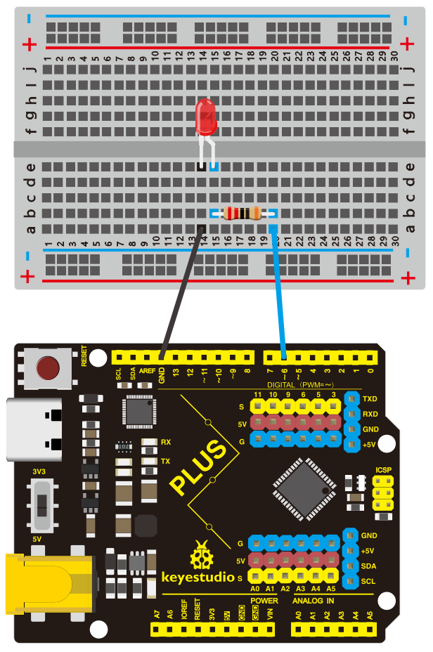

How to connect an LED


How to identify 5 band 220Ω Resistor


**5. Project Code**

```c
/*
keyestudio STEM Starter Kit
Project 3
Little Star
http//www.keyestudio.com
*/
int ledPin = 6;
 void setup() 
{
  pinMode(ledPin,OUTPUT);
}
void loop(){
  for (int value = 0 ; value < 255; value=value+1){
    analogWrite(ledPin, value);
    delay(5);
  }
  for (int value = 255; value >0; value=value-1){
    analogWrite(ledPin, value);
    delay(5);
  } }      
/////////////////////////////////////////////////////////////////
```


1. Open up the Arduino IDE and copy the below code into a new sketch.

2. Select the correct Board type and COM port for the Arduino IDE.

3. Click Upload button on Arduino IDE to upload code.

**6. Project Result**

Done uploading. You will see the LED lights gradually light up, and then gradually darken.

We put the card of a star on the LED, it looks like a twinkling star in the sky


### Project 4: Traffic Light


**1. Project Introduction**

Traffic lights are prevalent in our ordinary life. According to a certain time rule, lights operate traffic lights with three colors of red, yellow, and green. Everyone shall abide by traffic regulations, which can avoid many traffic accidents.

In this project, we will use a plus development board, a traffic light card, and some LEDs(red, yellow, and green) to simulate a traffic light.

**2. Project Hardware**

|  |  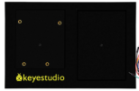               |  |  | 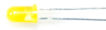 |
|----------------------------------------------------------------------------------|---------------------------------------------------------------------------------------------------|--------------------------------------------------------------------|-------------------------------------------------------------------------------------|--------------------------------------------------------------------------------|
| Plus Board\*1                                                                    | Plus Board Holder                                                                                 | 400-Hole Breadboard                                                |  USB Cable\*1                                                                       | Yellow M5 LED\*1                                                               |
| 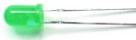         |  |                     |         |              |
| Green M5 LED\*1                                                                  | Red M5 LED\*1                                                                                     | 220Ω Resistor\*3                                                   | Preformed Jumper Wire\*3** **Flexible jumper Wire\*4                            | Traffic Light\*1                                                               |

**3. Circuit Connection**


**NOTE:**

How to connect an LED


How to identify 5 band 220Ω Resistor


**4. Project Code**

Since it is a simulation of traffic lights, the blinking time of each LED should be the same as those in traffic lights system.

In this program, we use Arduino **delay ()** function to control delay time, which is much simpler than C language.

```c
/*
keyestudio STEM Starter Kit 
Project 4
traffic light
http//www.keyestudio.com
*/
int redled =10; // initialize digital pin 10.
int yellowled =7; // initialize digital pin 7.
int greenled =4; // initialize digital pin 4.
void setup()
{
pinMode(redled, OUTPUT);// set the pin with red LED as “output”
pinMode(yellowled, OUTPUT); // set the pin with yellow LED as “output”
pinMode(greenled, OUTPUT); // set the pin with blue LED as “output”
}
void loop()
{
digitalWrite(greenled, HIGH);//// turn on green LED
delay(5000);// wait 5 seconds
digitalWrite(greenled, LOW); // turn off green LED
for(int i=0;i<3;i++)// blinks for 3 times
{
delay(500);// wait 0.5 second
digitalWrite(yellowled, HIGH);// turn on yellow LED
delay(500);// wait 0.5 second
digitalWrite(yellowled, LOW);// turn off yellow LED
} 
delay(500);// wait 0.5 second
digitalWrite(redled, HIGH);// turn on red LED
delay(5000);// wait 5 second
digitalWrite(redled, LOW);// turn off red LED
}
//////////////////////////////////////////////////////////////////
```

1. Open up the Arduino IDE and copy the above code into a new sketch.

2. Select the correct Board type and COM port for the Arduino IDE.

3. Click Upload button on Arduino IDE to upload code.

**5. Project Result**

Done uploading. Put the traffic light card on top of the three LEDs, and you have successfully made a traffic light.

1.  First, the green light will be on for 5 seconds, and then off.

2.  Second, the yellow light will blink for 3 times, and then off.

3.  Third, the red light will be on for 5 seconds, and then off.

4. Continue to run the above 1-3 steps until you cut off the power to the plus development board.


### Project 5: RGB LED


**1. Project Introduction**

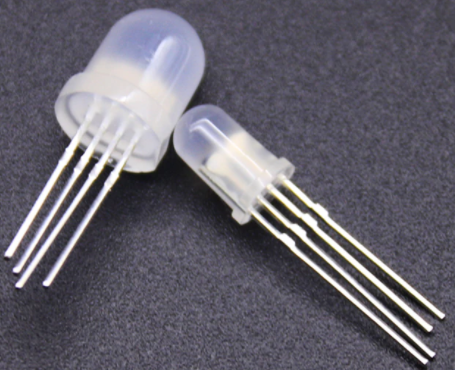

The RGB led, consisting of three colors（red, green and blue), can emit different colors by mixing this 3 basic colors.

In this project, we will introduce you RGB LED and show you how to use the Plus development board.

We also provide a RGB color card for you to understand it easier. Even though the RGB LED are extremely basic, it’s a great way to introduce yourself or others to the basics of electronics and coding.

**2. Project Hardware**

|  |  |             |  |
|-------------------------------------------------|-------------------------------------------------|------------------------------------------------------------|-------------------------------------------------|
| Plus Development Board\*1                       | Plus Board Holder                               | 400-Hole Breadboard                                        | USB Cable\*1                                    |
| 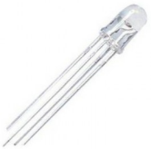 |  |             |  |
| RGB LED \* 1                                    |  220Ω Resistor\*3                               | **Preformed Jumper Wire\*2** **Flexible jumper Wire\*4**   | RGB color Card\*1                               |

**3. Little Knowledge**

The monitors mostly comply with the RGB color standard, and all the colors on the computer screen are composed of the three colors of red, green and blue mixed in different proportions.


This RGB LED has 4 pins, one for each color (Red, Green, Blue) and a common cathode. To change brightness of RGB led, we can use the PWM pins of Arduino. The PWM pins will give signal with different duty cycles to the RGB led to obtain different colors.

**4. Circuit Connection**


**NOTE：**

The longest pin (common cathode) of RGB LED is connected to GND.


How to identify 5 band 220Ω Resistor


**5. Project Code**

```c
/*
keyestudio STEM Starter Kit 
Project 5
Color Secret
http//www.keyestudio.com
*/
int redpin = 11; //select the pin for the red LED
int bluepin =9; // select the pin for the blue LED
int greenpin =10;// select the pin for the green LED
int val;
void setup() {
  pinMode(redpin, OUTPUT);
  pinMode(bluepin, OUTPUT);
  pinMode(greenpin, OUTPUT);
  Serial.begin(9600);
}
void loop() 
{
for(val=255; val>0; val--)
  {
   analogWrite(11, val);
   analogWrite(10, 255-val);
   analogWrite(9, 128-val);
   delay(1); 
  }
for(val=0; val<255; val++)
  {
   analogWrite(11, val);
   analogWrite(10, 255-val);
   analogWrite(9, 128-val);
   delay(1); 
  }
 Serial.println(val, DEC);
}
//////////////////////////////////////////////////////////////////

```


1. Open up the Arduino IDE and copy the above code into a new sketch.

2. Select the correct Board type and COM port for the Arduino IDE.

3. Click Upload button to upload the code.

**6. Project Result**

Done uploading! Wait for a few seconds, you can see a colorful LED. You can also put the RGB card we provide on top of it.

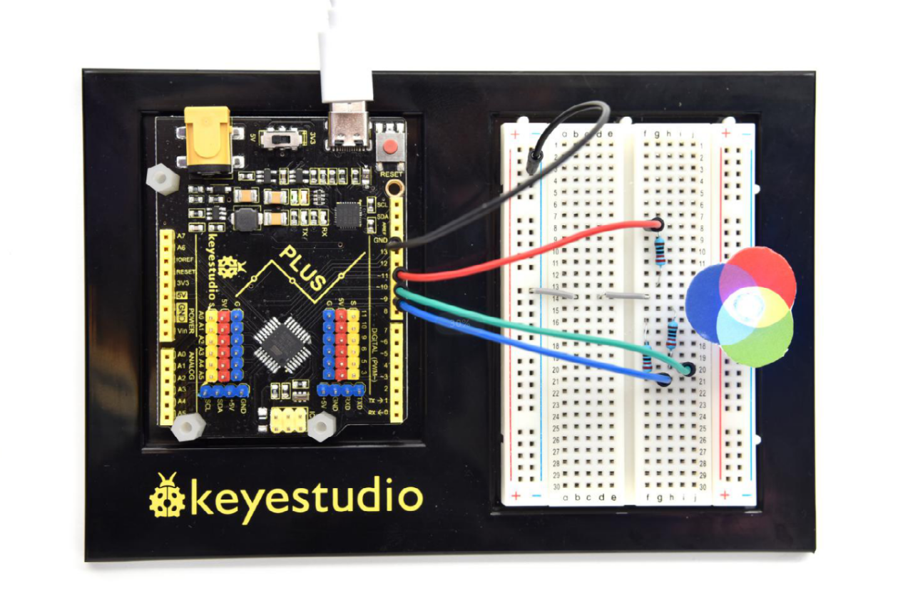

### Project 6: Battery Billboard

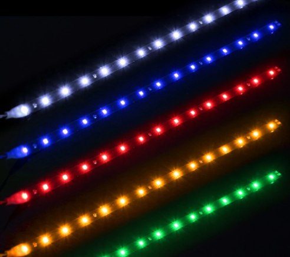

**1. Project Introduction**

We can see many billboards composed of different colour LEDs in daily life. They are constantly changing their light to attract customers' attention.

In this project, we will use 5 LEDs and a battery paper card to make an advertising panel about the battery. The sparkling light string makes it easy for customers to notice your battery if you are a battery salesperson.

**2. Project Hardware**

|  |  |   |  |
|-------------------------------------------------|-------------------------------------------------|--------------------------------------------------|-------------------------------------------------|
| Plus Development Board\*1                       |  Plus Board Holder                              | 400-Hole Breadboard                              | USB Cable\*1                                    |
|  |  |   |  |
| Red M5 LED\*5                                   | 220Ω Resistor\*5                                | Preformed Jumper Wire\*5 Flexible jumper Wire\*6 | battery billboard Card\*1                       |

**3. Circuit Connection**


**NOTE:**

How to connect an LED


How to identify 5 band 220Ω Resistor


**4. Project Code**

```c
/*
keyestudio STEM Starter Kit 
Project 6
Battery Billboard
http//www.keyestudio.com
*/
int BASE = 2 ;// the I/O pin for the first LED
int NUM = 5; // number of LEDs
void setup()
{
   for (int i = BASE; i < BASE + NUM; i ++) 
   {
     pinMode(i, OUTPUT);   // set I/O pins as output
   }
}
void loop()
{
   for (int i = BASE; i < BASE + NUM; i ++) 
   {
     digitalWrite(i, LOW); // set I/O pins as “low”, turn off LEDs one by one.
     delay(200); // delay
   }
   for (int i = BASE; i < BASE + NUM; i ++) 
   {
     digitalWrite(i, HIGH);   // set I/O pins as “high”, turn on LEDs one by one
     delay(200);  // delay
   }  
}
//////////////////////////////////////////////////////////////////
```

1. Open up the Arduino IDE and copy the above code into a new sketch.

2. Select the correct Board type and COM port for the Arduino IDE.

3. Click Upload button to upload the code.

**5. Project Result**

Done uploading！The 5 LEDs connected to the D2-D6 pins of the development board will gradually light up and then gradually turn off, just like a battery being charged.


### Project 7: Little Bee


**1. Project Introduction**

The active buzzer is a sounding component. it is widely used as a sound-making element on the computer, printer, alarm, electronic toy, telephone, timer and more. It has an inner vibration source. Simply connect it with 5V power supply,
it can buzz continuously.

In this project, we will use an active buzzer and a cartoon bee card to make a cute bee that can tweet.

**2. Project Hardware**

|                          |   |  |  |
|-------------------------------------------------------------------------|--------------------------------------------------|-------------------------------------------------|-------------------------------------------------|
| Plus Development Board\*1                                               |  Plus Board Holder                               | 400-Hole Breadboard                             | USB Cable\*1                                    |
|  |   |  |                                                 |
| Active buzzer\*1                                                        | Jumper Wire\*2                                   | Cartoon Small Bee Card\*1                       |                                                 |

**3. Little Knowledge**


The active buzzer inside has a simple oscillator circuit which can convert constant direct current into a certain frequency pulse signal. Once active buzzer receives a high level, it will produce an audible beep.

Passive buzzer is an integrated electronic buzzer without vibration source inside. It must be driven by 2K-5K square wave instead of direct current signals.

The appearance of the two buzzers is very similar, but the one with a green circuit board is a passive buzzer, while the other enclosed with a black tape is an active one. Passive buzzers don't differentiate positive while active polarity active buzzers do.

As shown below:


**4. Circuit Connection**


NOTE：Note: The positive pole of the active buzzer is connected to pin 8 ("+"/long pin), and the negative pole is connected to GND

**5. Project Code**

```c
/*
keyestudio STEM Starter Kit 
Project 7
Little bee 
http//www.keyestudio.com
*/
int buzzerPin = 8;
void setup ()
{
  pinMode (buzzerPin, OUTPUT);
}
void loop ()
{
  digitalWrite (buzzerPin, HIGH);
  delay (500);
  digitalWrite (buzzerPin, LOW);
  delay (500);
}
//////////////////////////////////////////////////////////////////
```

1. Open up the Arduino IDE and copy the above code into a new sketch.

2. Select the correct Board type and COM port for the Arduino IDE.

3. Click Upload button to upload the code.

**6. Project Result**

Done uploading！Put the cartoon paper of the little bee on it, You will get a little bee that can tweet.


### Project 8: Bird That Can Sing


**1. Project Introduction**

In the previous project, we studied the active buzzer, which can only emit one sound and may make you feel monotonous.

This project will learn another buzzer, passive buzzer. Unlike an active buzzer, a passive buzzer can emit sounds of different frequencies.

In this project, you will get a bird that can sing which is made by a cartoon bird card and the passive buzzer we provide.

**2. Project Hardware**

|                         |    |  |  |
|------------------------------------------------------------------------|---------------------------------------------------|-------------------------------------------------|-------------------------------------------------|
| Plus Development Board\*1                                              | Plus Board Holder                                 | 400-Hole Breadboard                             | USB Cable\*1                                    |
|  |    |  |                                                 |
| Passive Buzzer\*1                                                      | Jumper Wire\*2                                    | Cartoon Small Bird Card\*1                      |                                                 |

**3. Little knowledge**


Passive buzzer is an integrated electronic buzzer without vibration source inside. It must be driven by 2K-5K square wave instead of direct current signals. The appearance of the two buzzers is very similar, but the one with a green circuit board is a passive buzzer, while the other enclosed with a black tape is an active one. Passive buzzers don't differentiate positive while active
polarity active buzzers do.


**4. Circuit Connection**


**5. Project Code**

```c
/*
keyestudio STEM Starter Kit
Project 8
Singing bird
http//www.keyestudio.com
*/
#define NOTE_B0  31
#define NOTE_C1  33
#define NOTE_CS1 35
#define NOTE_D1  37
#define NOTE_DS1 39
#define NOTE_E1  41
#define NOTE_F1  44
#define NOTE_FS1 46
#define NOTE_G1  49
#define NOTE_GS1 52
#define NOTE_A1  55
#define NOTE_AS1 58
#define NOTE_B1  62
#define NOTE_C2  65
#define NOTE_CS2 69
#define NOTE_D2  73
#define NOTE_DS2 78
#define NOTE_E2  82
#define NOTE_F2  87
#define NOTE_FS2 93
#define NOTE_G2  98
#define NOTE_GS2 104
#define NOTE_A2  110
#define NOTE_AS2 117
#define NOTE_B2  123
#define NOTE_C3  131
#define NOTE_CS3 139
#define NOTE_D3  147
#define NOTE_DS3 156
#define NOTE_E3  165
#define NOTE_F3  175
#define NOTE_FS3 185
#define NOTE_G3  196
#define NOTE_GS3 208
#define NOTE_A3  220
#define NOTE_AS3 233
#define NOTE_B3  247
#define NOTE_C4  262
#define NOTE_CS4 277
#define NOTE_D4  294
#define NOTE_DS4 311
#define NOTE_E4  330
#define NOTE_F4  349
#define NOTE_FS4 370
#define NOTE_G4  392
#define NOTE_GS4 415
#define NOTE_A4  440
#define NOTE_AS4 466
#define NOTE_B4  494
#define NOTE_C5  523
#define NOTE_CS5 554
#define NOTE_D5  587
#define NOTE_DS5 622
#define NOTE_E5  659
#define NOTE_F5  698
#define NOTE_FS5 740
#define NOTE_G5  784
#define NOTE_GS5 831
#define NOTE_A5  880
#define NOTE_AS5 932
#define NOTE_B5  988
#define NOTE_C6  1047
#define NOTE_CS6 1109
#define NOTE_D6  1175
#define NOTE_DS6 1245
#define NOTE_E6  1319
#define NOTE_F6  1397
#define NOTE_FS6 1480
#define NOTE_G6  1568
#define NOTE_GS6 1661
#define NOTE_A6  1760
#define NOTE_AS6 1865
#define NOTE_B6  1976
#define NOTE_C7  2093
#define NOTE_CS7 2217
#define NOTE_D7  2349
#define NOTE_DS7 2489
#define NOTE_E7  2637
#define NOTE_F7  2794
#define NOTE_FS7 2960
#define NOTE_G7  3136
#define NOTE_GS7 3322
#define NOTE_A7  3520
#define NOTE_AS7 3729
#define NOTE_B7  3951
#define NOTE_C8  4186
#define NOTE_CS8 4435
#define NOTE_D8  4699
#define NOTE_DS8 4978
#define REST 0
int tempo=114; // change this to make the song slower or faster
int buzzer = 8;// change this to whichever pin you want to use
// notes of the moledy followed by the duration.
// a 4 means a quarter note, 8 an eighteenth , 16 sixteenth, so on
// !!negative numbers are used to represent dotted notes,
// so -4 means a dotted quarter note, that is, a quarter Plus an eighteenth!!
int melody[] = {
  NOTE_E4,4,  NOTE_E4,4,  NOTE_F4,4,  NOTE_G4,4,//1
  NOTE_G4,4,  NOTE_F4,4,  NOTE_E4,4,  NOTE_D4,4,
  NOTE_C4,4,  NOTE_C4,4,  NOTE_D4,4,  NOTE_E4,4,
  NOTE_E4,-4, NOTE_D4,8,  NOTE_D4,2,
  NOTE_E4,4,  NOTE_E4,4,  NOTE_F4,4,  NOTE_G4,4,//4
NOTE_G4,4,  NOTE_F4,4,  NOTE_E4,4,  NOTE_D4,4,
NOTE_C4,4,  NOTE_C4,4,  NOTE_D4,4,  NOTE_E4,4,
NOTE_D4,-4,  NOTE_C4,8,  NOTE_C4,2,
NOTE_D4,4,  NOTE_D4,4,  NOTE_E4,4,  NOTE_C4,4,//8
NOTE_D4,4,  NOTE_E4,8,  NOTE_F4,8,  NOTE_E4,4, NOTE_C4,4,
NOTE_D4,4,  NOTE_E4,8,  NOTE_F4,8,  NOTE_E4,4, NOTE_D4,4,
NOTE_C4,4,  NOTE_D4,4,  NOTE_G3,2,
NOTE_E4,4,  NOTE_E4,4,  NOTE_F4,4,  NOTE_G4,4,//12
NOTE_G4,4,  NOTE_F4,4,  NOTE_E4,4,  NOTE_D4,4,
NOTE_C4,4,  NOTE_C4,4,  NOTE_D4,4,  NOTE_E4,4,
NOTE_D4,-4,  NOTE_C4,8,  NOTE_C4,2
};
// sizeof gives the number of bytes, each int value is composed of two bytes (16 bits)
// there are two values per note (pitch and duration), so for each note there are four bytes
int notes=sizeof(melody)/sizeof(melody[0])/2; 
// this calculates the duration of a whole note in ms (60s/tempo)*4 beats
int wholenote = (60000 * 4) / tempo;
int divider = 0, noteDuration = 0;
void setup() {
  // iterate over the notes of the melody. 
  // Remember, the array is twice the number of notes (notes + durations)
  for (int thisNote = 0; thisNote < notes * 2; thisNote = thisNote + 2) {
    // calculates the duration of each note
    divider = melody[thisNote + 1];
    if (divider > 0) {
    noteDuration = (wholenote) / divider; // regular note, just proceed
    } else if (divider < 0) {
      // dotted notes are represented with negative durations!!
      noteDuration = (wholenote) / abs(divider);
      noteDuration *= 1.5; // increases the duration in half for dotted notes
    }
    // we only play the note for 90% of the duration, leaving 10% as a pause
    tone(buzzer, melody[thisNote], noteDuration*0.9);
  // Wait for the specief duration before playing the next note.
    delay(noteDuration);
 noTone(buzzer);  // stop the waveform generation before the next note.
  }
}
void loop() {
// if you want to repeat the song forever, paste the setup code here .
}
/////////////////////////////////////////////////////////////////
```


1. Open up the Arduino IDE and copy the above code into a new sketch.

2. Select the correct Board type and COM port for the Arduino IDE.

3. Click Upload button to upload the code.

**6. Project Result**

Upload the project code to the Plus development board.

Put the cartoon paper of the bird on it, and can get a bird that can sing a nice song.


### Project 9: Laser Bar


**1. Project Introduction**

In the previous project, we have learned how to light up a LED. There are only 22 IO ports on the Plus development board. How can we light up a large number of LEDs? At sometime may run out of pins on your Arduino board and need to extend it with shift registers.

You can use the 74HC595N to control 8 outputs at a time while only taking up a few pins on your microcontroller. You can also link multiple registers together to extend your output even more.

In this project, we will use 4 Red M5 LEDs, 3 Green M5 LEDs and the laser stick
card we provide to make an exciting laser stick model.

**2. Project Hardware**

|  |   |  |  |
|-------------------------------------------------|--------------------------------------------------|-------------------------------------------------|-------------------------------------------------|
| Plus Development Board\*1                       | Plus Board Holder                                | 400-Hole Breadboard                             | USB Cable\*1                                    |
|  |   |  |  |
| 74HC595 chip\*1                                 | Red M5 LED \*4                                   | Green M5 LED \*3                                | 220Ω Resistor\*7                                |
|  |   |                                                 |                                                 |
| Preformed/Flaxible Jumper Wire\*20+             | Laser Stick Paper Card\*1                        |                                                 |                                                 |

**3. 74HC595 Chip Pins Description：**


| Pins No | Name  | Function                     |
|---------|-------|------------------------------|
| 1-7, 15 | Q0-Q7 | Parallel Output              |
| 8       | GND   | GND                          |
| 9       | MR    | Serial Output                |
| 10      |       | Master Reserve , connect 5V  |
| 11      | SH_CP | Shift Register Clock Output  |
| 12      | ST_CP | Storage Register Clock Input |
| 13      | OE    | Output Enable (active LOW)   |
| 14      | DS    | Serial data input            |
| 16      | Vcc   | 5V working voltage           |

-   VCC and GND are used to supply power for chip, the working voltage is 5V.

-   Q0\~Q7:This eight pins are output pins.

-   DS pin is serial input pin, we need to write data into this pin by bit.

-   STCP is a latch pin. The data can be copied to latch and output in parallel after 8-digit data of latch is all transmitted.
    
-   SHCP is a clock pin. The data can be written into storage register.

-   OE is an output enable pin, which is used to make sure if the data of latch is input into Q0-Q7 pins. When in low level, high level is not output. In this experiment, we directly connect to GND to keep low level output data.
    
-   MR is a pin to initialize the pin of storage register. Initialize the internal storage register when low level. In this experiment, we connect to VCC to keep high level.
    
-   Q7S pin is a serial output pin, which is specially used for chip cascade.

**4. Circuit Connection**


NOTE：Pay attention to the inserting direction of 74HC595N


**5. Project Code**

```c
/*
keyestudio STEM Starter Kit 
Project 9
Star Wars Laser Rod
http//www.keyestudio.com
*/
int data = 4;// set pin 4 of 74HC595as data input pin SI 
int clock = 6;// set pin 6 of 74hc595 as clock pin SCK
int latch = 5;// set pin 5 of 74hc595 as output latch RCK 
int ledState = 0;
const int ON = HIGH;
const int OFF = LOW;
void setup()
{
pinMode(data, OUTPUT);
pinMode(clock, OUTPUT);
pinMode(latch, OUTPUT);
}
void loop()
{
for(int i = 0; i < 256; i++)
{
updateLEDs(i);
delay(500);
}
}
void updateLEDs(int value)
{
digitalWrite(latch, LOW);//
shiftOut(data, clock, MSBFIRST, ~value);// serial data “output”, high level first
digitalWrite(latch, HIGH);// latch
}
//////////////////////////////////////////////////////////////////
```
1. Open up the Arduino IDE and copy the above code into a new sketch.

2. Select the correct Board type and COM port for the Arduino IDE.

3. Click Upload button to upload the code.

**6. Project Result**

Done uploading！

Put the Laser stick paper card on the LED, you can see 7 LEDs are light one by one, Just like a laser stick full of power.


### Project 10: A Small Desk Lamp


**1. Project Introduction**

In fact, you can use Arduino to turn on an LED. In this project, we will use a cartoon lamp card, a button switch and an LED to make a small desk lamp.

**2. Project Hardware**

|      |    |  |  |
|-----------------------------------------------------|---------------------------------------------------|-------------------------------------------------|-------------------------------------------------|
| Plus Development Board\*1                           | Plus Board Holder                                 | 400-Hole Breadboard                             | USB Cable\*1                                    |
|  |    |  |  |
| Button switch\*1                                    | Red M5 LED \*1                                    | 10KΩ Resistor\*1                                | 220Ω Resistor\*1                                |
|      |    |                                                 |                                                 |
| Preformed&Flexible Jumper Wire                      | Desk lamp Paper Card\*1                           |                                                 |                                                 |

**3. Little Knowledge**

The button is a component that connects two points in a circuit when you press it.

**Schematic Diagrams:**  


**4. Circuit Connection**


**NOTE:**

How to connect an LED


How to identify 5 band 220Ω Resistor and a 5 band 10KΩ Resistor


**5. Project Code**

```c
/*
 keyestudio STEM Starter Kit
 Project 10
 Small desktop lamp
 http//www.keyestudio.com
*/
int ledpin=12;// initialize pin 12
int inpin=5;// initialize pin 5
int val;// define val
void setup()
{
pinMode(ledpin,OUTPUT);// set LED pin as “output”
pinMode(inpin,INPUT);// set button pin as “input”
}
void loop()
{
val=digitalRead(inpin);// read the level value of pin 7 and assign if to val
if(val==LOW)// check if the button is pressed, if yes, turn on the LED
{ digitalWrite(ledpin,LOW);}
else
{ digitalWrite(ledpin,HIGH);}
}
//////////////////////////////////////////////////////////////////
```

1. Open up the Arduino IDE and copy the above code into a new sketch.

2. Select the correct **Board type** and **COM** port for the Arduino IDE.

3. Click **Upload** to upload the code.

**6. Project Result**

Done uploading！We simulate a desk lamp.

When the button is pressed, LED will be on, otherwise, it remains off. In this way, the small desk lamp project is completed.


### Project 11: Digital Hourglass


**1. Project Introduction**

Once upon a time, people used hourglasses to measure time.

Today, we DIY a digital hourglass by using a hourglass Paper Card, a Plus Development Board, 5 Red M5 LEDs, a Ball switch.

**2. Project Hardware**

|  |  |  |  |
|-------------------------------------------------|-------------------------------------------------|-------------------------------------------------|-------------------------------------------------|
| Plus Development Board\*1                       | Plus Board Holder                               | 400-Hole Breadboard                             | USB Cable\*1                                    |
|  |  |  |  |
| Ball switch\*1                                  | Red M5 LED \*5                                  | 10KΩ Resistor\*1                                | 220Ω Resistor\*5                                |
|  |  |                                                 |                                                 |
| Jumper Wire\*12                                 | hourglass Paper Card\*1                         |                                                 |                                                 |

**3. Working Principle**


The ball switch is a digital switch. There is a metal ball inside it that can roll. The principle of the metal ball rolling and contacting the guide pin is used to control the on or off of the circuit.

When one end of the switch is below horizontal position, the switch is on. The voltage of the analog port is about 5V (1023 in binary). The LED will be on.

When the other end of the switch is below horizontal position, the switch is off. The voltage of the analog port is about 0V (0 in binary). The LED will be off.

In the program, we determine whether the switch is on or off according to the voltage value of the analog port, whether it's above 2.5V (512 in binary) or not.

**4. Circuit Connection**


**NOTE:**

How to connect an LED


How to identify 5 band 220Ω Resistor and a 5 band 10KΩ Resistor


**5. Project Code**

```c
/*
keyestudio STEM Starter Kit 
Project 11
Digital Hourglass
http//www.keyestudio.com
*/
const byte SWITCH_PIN = 4; // connect tilt switch to D4
byte switch_state = 0;
void setup()
{
     for(int i=8;i<12;i++)
  {
        pinMode(i, OUTPUT);
  } 
    pinMode(SWITCH_PIN, INPUT);
 for(int i=8;i<12;i++)
  {
    digitalWrite(i,0);
  } 
  Serial.begin(9600);
}
void loop()
{
switch_state = digitalRead(SWITCH_PIN); 
Serial.println(switch_state);
 if (switch_state == 0) 
 {
 for(int i=8;i<12;i++)
  {
    digitalWrite(i,1);
    delay(1000);
  } 
  }
   if (switch_state == 1) 
 {
   for(int i=11;i>7;i--)
   {
    digitalWrite(i,0);
    delay(1000);
   }
  }
}//////////////////////////////////////////////////////////////////

```

1. Open up the Arduino IDE and copy the above code into a new sketch.

2. Select the correct Board type and COM port for the Arduino IDE.

3. Click Upload button to upload the code.

**6. Project Result**

Hold the breadboard with your hands. Tilt to a certain angle, the LEDs will light up one by one. When returning to the previous angle, the LEDs will turn off one by one. Just like an hourglass, the sand leaked out over time.


### Project 12: A Guard Dog

****

**1. Project Introduction**

PIR sensors measure infrared (IR) light radiating from moving objects that emit heat. The sensor allows you to detect motion of people, animals and cars to trigger security alarms and lighting. They are used to detect movement and are ideal for security and safety such as burglar alarms and security lighting systems.

In this project, we will use a PIR motion sensor, a buzzer, and a cartoon dog card to make a guard dog that sounds when someone or an animal moves nearby.

**2. Project Hardware**

|  |                         |  |  |
|-------------------------------------------------|------------------------------------------------------------------------|-------------------------------------------------|-------------------------------------------------|
| Plus Development Board\*1                       | Plus Board Holder                                                      | 400-Hole Breadboard                             | USB Cable\*1                                    |
|  |  |  |  |
| PIR Motion Sensor\*1                            | Passive Buzzer\*1                                                      | Jumper Wire\*5                                  | Guard dog Paper Card\*1                         |

**3. PIR Motion Sensor Specification**


-   Input Voltage 3.3 \~ 5V (6V Maximum)

-   Working Current 15uA

-   Working Temperature -20 \~ 85 ℃

-   Output Voltage High 3V, Low 0V

-   Output Delay Time (High Level) About 2.3 to 3 Seconds

-   Detection Angle 100 °

-   Detection Distance 7 meters

-   Output Indicator LED (When output HIGH, it will be ON)

-   Pin limit Current 100mA

**4. Circuit Connection**


**5. Project Code**

```c
/*
keyestudio STEM Starter Kit 
Project 12
Guard dog
http//www.keyestudio.com
*/

int buzzerpin = 8;  // buzzer pin
int pirPin = 3;     // PIR Out pin 
int pirStat = 0;   // PIR status 
void setup() {
 pinMode(buzzerpin, OUTPUT);     
 pinMode(pirPin, INPUT);     
 Serial.begin(9600);
}
void loop()
{
 pirStat = digitalRead(pirPin); 
 if (pirStat == HIGH)
 {            // if motion detected
   digitalWrite(buzzerpin, HIGH);  // turn buzzer ON
   Serial.println("Hey I got you!!!");
 } 
 else {
   digitalWrite(buzzerpin, LOW); // turn buzzer OFF if we have no motion
 }
}//////////////////////////////////////////////////////////
```

1. Open up the Arduino IDE and copy the above code into a new sketch.

2. Select the correct Board type and COM port for the Arduino IDE.

3. Click Upload button to upload the code.

**6. Project Result**

If the PIR motion sensor detects someone moving nearby, the buzzer will sound an alarm, and click to open the serial monitor on the Arduino IDE, you will see "Hey I got you!!!".


### Project 13: DIY A Time Bomb


**1. Project Introduction**

A seven-segment display is a form of the electronic display device for displaying decimal numerals, they are widely used in digital clocks, electronic meters, basic calculators, and other electronic devices that display numerical information. Even the bombs we saw in the movie have seven-segment displays.

Perhaps seven-segment displays don’t look modern enough for you, but they are alternatives to the more complex dot matrix displays and are easy to use both in limited light conditions and in strong sunlight.

In this project, we will make a simple time bomb with a 1-digit LED Segment Display.

**2. Project Hardware**

|   |    |  |  |
|--------------------------------------------------|---------------------------------------------------|-------------------------------------------------|-------------------------------------------------|
| Plus Development Board\*1                        | Plus Board Holder                                 | 400-Hole Breadboard                             | USB Cable\*1                                    |
|   |    |  |                                                 |
| 1-digit LED Segment Display\*1                   | 220Ω Resistor\*8                                  | Jumper Wire\*10+                                |                                                 |

**3. 1-digit LED Segment Display principle**


LED segment display is a semiconductor light-emitting device. Its basic unit is a light-emitting diode (LED).

LED segment display can be divided into the 7-segment display and 8-segment display according to the number of segments. The 8-segment display has one more LED unit ( for decimal point display) than 7-segment one.

Each segment of the seven segment LED display is an individual LED. According to the wiring method of LED units, LED segment displays can be divided into common anode displays and common cathode displays.

In a Common Cathode seven segment display. All of the cathodes (or negative terminals) of the segment LEDs are connected together. You should connect the common cathode to GND. To turn on a segment, you set its associated pin to HIGH.

In a Common Anode seven segment display, the anodes (positive terminals) of all of the segments are connected together. You should connect the common anode to +5V. To turn on a segment, you set its associated pin to LOW.


Each segment of the display consists of an LED. So when you use it, you also need to use a current-limiting resistor. Otherwise, LED will be burnt out.

In this experiment, we use a common cathode display. As we mentioned above, you should connect the common cathode to GND. To turn on a segment, you set its associated pin to HIGH。

**4. Circuit Connection**


**NOTE：**

The direction of the seven-segment display inserted into the panel is consistent with the wiring diagram, and an extra point is in the lower right corner


**5.Project Code**

There are seven segments for numerical display, one for decimal point display. Corresponding segments will be turned on when displaying certain numbers.

For example, when displaying number 1, b and c segments will be turned on. We compile a subprogram for each number, and compile the main program to display one number every 2 seconds, cycling display number 0 \~ 9.

The displaying time for each number is subject to the delay time, the longer the delay time, the longer the displaying time.

```c
/*
keyestudio STEM Starter Kit
Project 13
Bomb Timer
http//www.keyestudio.com
*/
// set the IO pin for each segment
int a=7;// set digital pin 7 for segment a
int b=6;// set digital pin 6 for segment b
int c=5;// set digital pin 5 for segment c
int d=10;// set digital pin 10 for segment d
int e=11;// set digital pin 11 for segment e
int f=8;// set digital pin 8 for segment f
int g=9;// set digital pin 9 for segment g
int dp=4;// set digital pin 4 for segment dp
void digital_0(void) // display number 5
{
unsigned char j;
digitalWrite(a,HIGH);
digitalWrite(b,HIGH);
digitalWrite(c,HIGH);
digitalWrite(d,HIGH);
digitalWrite(e,HIGH);
digitalWrite(f,HIGH);
digitalWrite(g,LOW);
digitalWrite(dp,LOW);
}
void digital_1(void) // display number 1
{
unsigned char j;
digitalWrite(c,HIGH);// set level as “high” for pin 5, turn on segment c
digitalWrite(b,HIGH);// turn on segment b
for(j=7;j<=11;j++)// turn off other segments
digitalWrite(j,LOW);
digitalWrite(dp,LOW);// turn off segment dp
}
void digital_2(void) // display number 2
{
unsigned char j;
digitalWrite(b,HIGH);
digitalWrite(a,HIGH);
for(j=9;j<=11;j++)
digitalWrite(j,HIGH);
digitalWrite(dp,LOW);
digitalWrite(c,LOW);
digitalWrite(f,LOW);
}
void digital_3(void) // display number 3
{digitalWrite(g,HIGH);
digitalWrite(a,HIGH);
digitalWrite(b,HIGH);
digitalWrite(c,HIGH);
digitalWrite(d,HIGH);
digitalWrite(dp,LOW);
digitalWrite(f,LOW);
digitalWrite(e,LOW);
}
void digital_4(void) // display number 4
{digitalWrite(c,HIGH);
digitalWrite(b,HIGH);
digitalWrite(f,HIGH);
digitalWrite(g,HIGH);
digitalWrite(dp,LOW);
digitalWrite(a,LOW);
digitalWrite(e,LOW);
digitalWrite(d,LOW);
}
void digital_5(void) // display number 5
{
unsigned char j;
digitalWrite(a,HIGH);
digitalWrite(b, LOW);
digitalWrite(c,HIGH);
digitalWrite(d,HIGH);
digitalWrite(e, LOW);
digitalWrite(f,HIGH);
digitalWrite(g,HIGH);
digitalWrite(dp,LOW);
}
void digital_6(void) // display number 6
{
unsigned char j;
for(j=7;j<=11;j++)
digitalWrite(j,HIGH);
digitalWrite(c,HIGH);
digitalWrite(dp,LOW);
digitalWrite(b,LOW);
}
void digital_7(void) // display number 7
{
unsigned char j;
for(j=5;j<=7;j++)
digitalWrite(j,HIGH);
digitalWrite(dp,LOW);
for(j=8;j<=11;j++)
digitalWrite(j,LOW);
}
void digital_8(void) // display number 8
{
unsigned char j;
for(j=5;j<=11;j++)
digitalWrite(j,HIGH);
digitalWrite(dp,LOW);
}
void digital_9(void) // display number 5
{
unsigned char j;
digitalWrite(a,HIGH);
digitalWrite(b,HIGH);
digitalWrite(c,HIGH);
digitalWrite(d,HIGH);
digitalWrite(e, LOW);
digitalWrite(f,HIGH);
digitalWrite(g,HIGH);
digitalWrite(dp,LOW);
}
void setup()
{
int i;// set variable
for(i=4;i<=11;i++)
pinMode(i,OUTPUT);// set pin 4-11as “output”
}
void loop()
{
while(1)
{
digital_9();// display number 9
delay(1000); // wait for 1s
digital_8();// display number 8
delay(1000); // wait for 1s
digital_7();// display number 7
delay(1000); // wait for 1s
digital_6();// display number 6
delay(1000); // wait for 1s
digital_5();// display number 5
delay(1000); // wait for 1s
digital_4();// display number 4
delay(1000); // wait for 1s
digital_3();// display number 3
delay(1000); // wait for 1s
digital_2();// display number 2
delay(1000); // wait for 1s
digital_1();// display number 1
delay(1000);// wait for 1s
digital_0();// display number 0
delay(1000);// wait for 1s
}}
//////////////////////////////////////////////////////////////////
```

1. Open up the Arduino IDE and copy the above code into a new sketch.

2. Select the correct Board type and COM port for the Arduino IDE.

3. Click Upload button to upload the code.

**6.Project Result**

Done uploading the code! The LED segment display will show the number from 9 to 0, at this time an interesting time bomb is complete.


### Project 14: Hand Counter

****

**1. Project Introduction**

4-digit 7-segment LED display is a very practical display device. The display of electronic clocks, the scorer on the court, and the number of people in the park are all needed.

Because of its low price and easy use, more and more projects will use 4-digit 7-segment LED display.

In this project, we use 4-digit 7-segment LED display to make a hand counter.

**2. Project Hardware**

|  |   |  |       |
|-------------------------------------------------|--------------------------------------------------|-------------------------------------------------|------------------------------------------------------|
| Plus Development Board\*1                       | Plus Board Holder                                | 400-Hole Breadboard                             | USB Cable\*1                                         |
|  |   |  |   |
| 4-digit LED Segment Display\*1                  | 220Ω Resistor\*8                                 | Jumper Wire\*10+                                | Button Switch\*1                                     |
|  |                                                  |                                                 |                                                      |
| 10KΩ Resistor\*1                                |                                                  |                                                 |                                                      |

**3. The Principle of 4-digit Display**


For 4-digit display, there are 12 pins in total. When you place the decimal point downward, the pin on the lower left part is referred to as 1, the upper left part 12.


**4. Circuit Connection**

For LED display, current-limiting resistors are indispensable. Here We use 8 Resistors of 220Ω.


**5. Project Code**

```c
/*
keyestudio STEM Starter Kit
Project 14
Hand Counter
http//www.keyestudio.com
*/
int a = 1;
int b = 2;
int c = 3;
int d = 4;
int e = 5;
int f = 6;
int g = 7;
int dp = 8;

int d4 = 9;
int d3 = 10;
int d2 = 11;
int d1 = 12;
// set variable
volatile int PushCounter;
volatile int State;
volatile int lastState;  
int val1=0;        
int val2=0;        
int val3=0;               
int val4=0;     
void setup()
{
  pinMode(d1, OUTPUT);
  pinMode(d2, OUTPUT);
  pinMode(d3, OUTPUT);
  pinMode(d4, OUTPUT);
  pinMode(a, OUTPUT);
  pinMode(b, OUTPUT);
  pinMode(c, OUTPUT);
  pinMode(d, OUTPUT);
  pinMode(e, OUTPUT);
  pinMode(f, OUTPUT);
  pinMode(g, OUTPUT);
  pinMode(dp, OUTPUT);
    PushCounter = 0;
    State = 0;
    lastState = 0;
    pinMode(13, INPUT);
}
/////////////////////////////////////////////////////////////
void loop()
{
  unsigned long currentMillis = millis();
  while(1)
  {
    while(millis()-currentMillis<100)
     {
     Display(1, val1);
     Display(2, val2);
     Display(3, val3);
     Display(4, val4);
     }
    currentMillis = millis(); 
    State = digitalRead(13);
    if (State != lastState) {
    if (State == 1) {
      PushCounter = PushCounter + 1;
    if (PushCounter>9999) 
    {
    PushCounter = 0;
    }
    }
  }
  lastState = State;
  val1=PushCounter/1000;
  val2=(PushCounter%1000)/100;
  val3=(PushCounter%100)/10;
  val4=PushCounter%10;
  }  
}
///////////////////////////////////////////////////////////////
void WeiXuan(unsigned char n)//
{
  switch (n)
  {
    case 1:
      digitalWrite(d1, LOW);
      digitalWrite(d2, HIGH);
      digitalWrite(d3, HIGH);
      digitalWrite(d4, HIGH);
      break;
    case 2:
      digitalWrite(d1, HIGH);
      digitalWrite(d2, LOW);
      digitalWrite(d3, HIGH);
      digitalWrite(d4, HIGH);
      break;
    case 3:
      digitalWrite(d1, HIGH);
      digitalWrite(d2, HIGH);
      digitalWrite(d3, LOW);
      digitalWrite(d4, HIGH);
      break;
    case 4:
      digitalWrite(d1, HIGH);
      digitalWrite(d2, HIGH);
      digitalWrite(d3, HIGH);
      digitalWrite(d4, LOW);
      break;
    default :
      digitalWrite(d1, HIGH);
      digitalWrite(d2, HIGH);
      digitalWrite(d3, HIGH);
      digitalWrite(d4, HIGH);
      break;
  }
}
void Num_0()
{
  digitalWrite(a, HIGH);
  digitalWrite(b, HIGH);
  digitalWrite(c, HIGH);
  digitalWrite(d, HIGH);
  digitalWrite(e, HIGH);
  digitalWrite(f, HIGH);
  digitalWrite(g, LOW);
  digitalWrite(dp, LOW);
}
void Num_1()
{
  digitalWrite(a, LOW);
  digitalWrite(b, HIGH);
  digitalWrite(c, HIGH);
  digitalWrite(d, LOW);
  digitalWrite(e, LOW);
  digitalWrite(f, LOW);
  digitalWrite(g, LOW);
  digitalWrite(dp, LOW);
}
void Num_2()
{
  digitalWrite(a, HIGH);
  digitalWrite(b, HIGH);
  digitalWrite(c, LOW);
  digitalWrite(d, HIGH);
  digitalWrite(e, HIGH);
  digitalWrite(f, LOW);
  digitalWrite(g, HIGH);
  digitalWrite(dp, LOW);
}
void Num_3()
{
  digitalWrite(a, HIGH);
  digitalWrite(b, HIGH);
  digitalWrite(c, HIGH);
  digitalWrite(d, HIGH);
  digitalWrite(e, LOW);
  digitalWrite(f, LOW);
  digitalWrite(g, HIGH);
  digitalWrite(dp, LOW);
}
void Num_4()
{
  digitalWrite(a, LOW);
  digitalWrite(b, HIGH);
  digitalWrite(c, HIGH);
  digitalWrite(d, LOW);
  digitalWrite(e, LOW);
  digitalWrite(f, HIGH);
  digitalWrite(g, HIGH);
  digitalWrite(dp, LOW);
}
void Num_5()
{
  digitalWrite(a, HIGH);
  digitalWrite(b, LOW);
  digitalWrite(c, HIGH);
  digitalWrite(d, HIGH);
  digitalWrite(e, LOW);
  digitalWrite(f, HIGH);
  digitalWrite(g, HIGH);
  digitalWrite(dp, LOW);
}
void Num_6()
{
  digitalWrite(a, HIGH);
  digitalWrite(b, LOW);
  digitalWrite(c, HIGH);
  digitalWrite(d, HIGH);
  digitalWrite(e, HIGH);
  digitalWrite(f, HIGH);
  digitalWrite(g, HIGH);
  digitalWrite(dp, LOW);
}
void Num_7()
{
  digitalWrite(a, HIGH);
  digitalWrite(b, HIGH);
  digitalWrite(c, HIGH);
  digitalWrite(d, LOW);
  digitalWrite(e, LOW);
  digitalWrite(f, LOW);
  digitalWrite(g, LOW);
  digitalWrite(dp, LOW);
}
void Num_8()
{
  digitalWrite(a, HIGH);
  digitalWrite(b, HIGH);
  digitalWrite(c, HIGH);
  digitalWrite(d, HIGH);
  digitalWrite(e, HIGH);
  digitalWrite(f, HIGH);
  digitalWrite(g, HIGH);
  digitalWrite(dp, LOW);
}
void Num_9()
{
  digitalWrite(a, HIGH);
  digitalWrite(b, HIGH);
  digitalWrite(c, HIGH);
  digitalWrite(d, HIGH);
  digitalWrite(e, LOW);
  digitalWrite(f, HIGH);
  digitalWrite(g, HIGH);
  digitalWrite(dp, LOW);
}
void Clear()    // clear the screen
{
  digitalWrite(a, LOW);
  digitalWrite(b, LOW);
  digitalWrite(c, LOW);
  digitalWrite(d, LOW);
  digitalWrite(e, LOW);
  digitalWrite(f, LOW);
  digitalWrite(g, LOW);
  digitalWrite(dp, LOW);
}
void pickNumber(unsigned char n)// select number
{
  switch (n)
  {
    case 0: Num_0();
      break;
    case 1: Num_1();
      break;
    case 2: Num_2();
      break;
    case 3: Num_3();
      break;
    case 4: Num_4();
      break;
    case 5: Num_5();
      break;
    case 6: Num_6();
      break;
    case 7: Num_7();
      break;
    case 8: Num_8();
      break;
    case 9: Num_9();
      break;
    default: Clear();
      break;
  }
}
void Display(unsigned char x, unsigned char Number)
//    take x as coordinate and display number
{
  WeiXuan(x);
  pickNumber(Number);
  delay(1);
  Clear() ; // clear the screen
}
//////////////////////////////////////////////////////////
```
**6.Project Result**

Upload the project code to the Plus development board. At the beginning, the 4-digit digital tube displays 0000. Each time the button is pressed, the number increases by 1. When the number is increased to 9999, press the button again, and the digital tube restarts and displays 0000.


### Project 15: Beating Heart


**1. Project Introduction**

A dot-matrix display is an electronic digital display device that displays information on machines, clocks and watches, public transport departure indicators and many other devices.

In this project, we use a 8x8 LED dot matrix to make a beating heart.

**2. Project Hardware**

|  |   |  |  |
|-------------------------------------------------|--------------------------------------------------|-------------------------------------------------|-------------------------------------------------|
| Plus Board\*1                                   | Plus Board Holder                                | 400-Hole Breadboard                             | USB Cable\*1                                    |
|  |   |  |                                                 |
| 8\*8 Dot Matrix\*1                              | 220Ω Resistor\*8                                 | Jumper Wire\*10+                                |                                                 |

**3. Principle of 8\*8 dot-matrix**


The external view of a dot-matrix is shown as follows


The internal view of a dot-matrix is shown as follows


The 8\*8 dot-matrix is made up of sixty-four LEDs, and each LED is placed at the cross point of a row and a column.

When the electrical level of a certain row is 1 and the electrical level of a certain column is 0, the corresponding LED will lighten. If you want to light the LED on the first dot, you should set pin 9 to high level and pin 13 to low level.

If you want to light LEDs on the first row, you should set pin 9 to high level and pins 13, 3, 4, 10, 6, 11, 15 and 16 to low level.

If you want to light the LEDs on the first column, set pin 13 to low level and pins 9, 14, 8, 12, 1, 7, 2 and 5 to high level.

**4. Circuit Connection**


**5. Project Code**

```c
/*
keyestudio STEM Starter Kit
Project 15
Beating Heart
http//www.keyestudio.com
*/
// 2-dimensional array of row pin numbers:
int R[] = {2,3,4,5,6,7,8,9};  
// 2-dimensional array of column pin numbers:
int C[] = {10,11,12,13,14,15,16,17};    
  
unsigned char biglove[8][8] =     //the big "heart"   
{  
  0,0,0,0,0,0,0,0,  
  0,1,1,0,0,1,1,0,  
  1,1,1,1,1,1,1,1,  
  1,1,1,1,1,1,1,1,  
  1,1,1,1,1,1,1,1,  
  0,1,1,1,1,1,1,0,  
  0,0,1,1,1,1,0,0,  
  0,0,0,1,1,0,0,0,  
};  
  
unsigned char smalllove[8][8] =      //the small "heart" 
{  
  0,0,0,0,0,0,0,0,  
  0,0,0,0,0,0,0,0,  
  0,0,1,0,0,1,0,0,  
  0,1,1,1,1,1,1,0,  
  0,1,1,1,1,1,1,0,  
  0,0,1,1,1,1,0,0,  
  0,0,0,1,1,0,0,0,  
  0,0,0,0,0,0,0,0,  
};  
  
void setup()  
{  
   // iterate over the pins:
  for(int i = 0;i<8;i++)  
  // initialize the output pins:
  {  
    pinMode(R[i],OUTPUT);  
    pinMode(C[i],OUTPUT);  
  }  
}  
  
void loop()  
{  
  for(int i = 0 ; i < 100 ; i++)        //Loop display 100 times 
  {  
    Display(biglove);                   //Display the "Big Heart"  
  }  
  for(int i = 0 ; i < 50 ; i++)         //Loop display 50 times
  {     
    Display(smalllove);                 //Display the "small Heart" 
  }  
}  
  
void Display(unsigned char dat[8][8])    
{  
  for(int c = 0; c<8;c++)  
  {  
    digitalWrite(C[c],LOW);//use thr column 
    //loop
    for(int r = 0;r<8;r++)  
    {  
      digitalWrite(R[r],dat[r][c]);  
    }  
    delay(1);  
    Clear();  //Remove empty display light
  }  
}  
void Clear()                        
{  
  for(int i = 0;i<8;i++)  
  {  
    digitalWrite(R[i],LOW);  
    digitalWrite(C[i],HIGH);  
  }  
}  //////////////////////////////////////////////////////////
```

**6.Project Result**

Upload the project code to the Plus development board，the 8\*8 dot matrix screen shows a beating heart.


### Project 16: An Expressive Frog


**1. Project Introduction**

In this project, we will make a frog that can communicate with the outside world and express its emotions in words. Here we use an LCD 1602 display controlled by Arduino.

The ordinary 1602 LCD display needs to occupy 7 IO ports of the control board when working. The 1602 LCD display we provide is equipped with IIC / I2C interface, which will save you 5 IO ports of the control board.

KEYESTUDIO 1602 I2C module is a 16 character by 2 line LCD display with Blue background and White backlight. It is very convenient to use with Arduino Liquid Crystal Library and great for showing letters, numbers, and characters.

On the back of LCD display there is a blue potentiometer. You can turn the potentiometer to adjust the contrast.


(Notice that when you rotate the potentiometer the screen will get brighter or darker, the proper angle will make the font clearer).

**2. Project Hardware**

|  |   |  |  |
|-------------------------------------------------|--------------------------------------------------|-------------------------------------------------|-------------------------------------------------|
| Plus Development Board\*1                       | Plus Board Holder                                | 400-Hole Breadboard                             | USB Cable\*1                                    |
|  |   |  |                                                 |
| I2C 1602 LCD\*1                                 | Jumper Wire\*4                                   | Cartoon Frog Paper Card\*1                      |                                                 |

**3. I2C 1602 LCD Parameters**


-   Display capacity 16 \* 2 characters

-   Chip operating voltage 4.5 \~ 5.5V

-   Working current 2.0mA (5.0V)

-   Optimum working voltage of the module is 5.0V

-   Character size 2.95 \* 4.35 (W \* H) mm

-   I2C Address:0x27

-   Backlight (Blue with white char color)

**4. Connection**

GND: connect to ground

VCC: connect to +5V

SDA: connect to A4

SCL: connect to A5


**5. Project Code**

```c
/*
keyestudio STEM Starter Kit
Project 16
Frog Display Screen
http//www.keyestudio.com
*/
#include <Wire.h>
#include <LiquidCrystal_I2C.h>
LiquidCrystal_I2C lcd(0x27,16,2); // set the LCD address to 0x27 
void setup()
{
lcd.init(); // initialize the lcd
lcd.init();
lcd.backlight();

}
void loop()
{
lcd.setCursor(2,0);
lcd.print("Hello, world!");
lcd.setCursor(2,1);
lcd.print("keyestudio!");
}
//////////////////////////////////////////////////////////
```

**6.Project Result**

Upload the project code to the Plus development board. LCD1602 will display “Hello, world!”on the first line, “keyestudio!” on the second line.

By changing the text in the brackets of the code we provided and uploading the code again, you can control what the frog will say through the LCD display.

lcd.print("Hello, world!");

lcd.setCursor(2,1);

lcd.print("keyestudio!");


### Project 17: Small Fan


**1. Project Introduction**

Usually, the GPIO pins of Arduino can only provide a maximum current of 40 mA. Since even a small 5V DC motor needs 50 mA or higher current to be driven, it is not recommended to use the Arduino GPIO pins to drive the DC motor.

In this project, we will use a Plus Development Board, a TIP122 triode, a motor and small fan leaf to make an electric fan.

**2. Project Hardware**

|  |    |  |  |
|-------------------------------------------------|---------------------------------------------------|-------------------------------------------------|-------------------------------------------------|
| Plus Development Board\*1                       | Plus Board Holder                                 | 400-Hole Breadboard                             | USB Cable\*1                                    |
|  |    |  |  |
| TIP122 Triode\*1                                | 1 KΩ Resistor \*1                                 | 9V Battery \*1                                  | 9V Battery holder \*1                           |
|  |    |  |                                                 |
| Fan Motor \*1                                   | Fan Leaf \*1                                      | Jumper Wire\*10+                                |                                                 |

**3. TIP122 Parameters:**


Voltage: Vceo: 100V;  
Power consumption, Pd: 65W;  
Collector DC current: 5A;  
DC current gain hFE: 1000;  
Package type: TO-220;  
Number of pins: 3;  
Total power, Ptot: 65W;  
Number of transistors: 1;  
Transistor type: Power Darlington;  
Maximum continuous current, Ic: 5A;  
Temperature: 25°C;  
Voltage, Vcbo: 100V;  
Current, Ic hFE: 3A;  
Current, Ic maximum: 5A;  
DC current gain hfe, minimum value: 1000;  
Surface mount devices: through-hole mounting;  
Collector current, average value of Ic: 5A;  
Saturation voltage, Vce sat maximum: 2V


**4. Connection Diagram**


**5. Project Code**

```c
/*
keyestudio Maker learning kit
Project 17
Small Fan
http//www.keyestudio.com
*/
// the setup function runs once when you press reset or power the board
void setup() {
  // initialize digital pin 3 as an output.
  pinMode(3, OUTPUT);
}
// the loop function runs over and over again forever
void loop() {
  digitalWrite(3, HIGH);   // turn the motor on (HIGH is the voltage level)
  delay(2000);            // wait for 2 seconds
  digitalWrite(3, LOW);    // turn the motor off by making the voltage LOW
  delay(3000);            // wait for 3 second
}
//////////////////////////////////////////////////////////
```

**6.Project Result**

Upload the project code to the Plus development board.

Insert the fan blade into the motor shaft, you will get a small fan that rotates for 2 seconds, and stops for 3 seconds, then restart.


### Project 18: Car Speed Dial


**1. Project Introduction**

A servo motor is a type of motor that can rotate with great precision. It has been widely used in many applications like toy car, RC helicopters and planes, Robotics, etc.

In this project, we will use a servo motor and a paper card to DIY a car speed dial.

**2. Project Hardware**

|  |   |  |  |
|-------------------------------------------------|--------------------------------------------------|-------------------------------------------------|-------------------------------------------------|
| Plus Development Board\*1                       | Plus Board Holder                                | 400-Hole Breadboard                             | USB Cable\*1                                    |
|  |   |                                                 |                                                 |
| 9G Servo Motor\*1                               | Car Speed Dial Paper Card\*1                     |                                                 |                                                 |

**3. Working Principle of the Servo**


Servo is composed of a rudder disc, position feedback potentiometer, reduction gear set, DC motor, and control circuit. A DC motor drives the reduction gear set, and its output shaft drives a position feedback potentiometer with linear proportional characteristics as position detection. According to the potentiometer feedback voltage, the control circuit compares with the external input control pulse, generates a correction pulse, controls and drives the DC motor to rotate forward or reverse so that the output position of the reduction gear is combined with the desired value. To achieve the purpose of accurately controlling the steering angle.

The control pulse cycle of the servo is 20ms, and the pulse width ranges from 0.5ms to 2.5ms, corresponding to positions from -90 degrees to +90 degrees.

Let us take a 180-degree angle servo as an example:


Servo motor comes with many specifications. But all of them have three connection wires, distinguished by brown, red, orange (different brand may have different color).

Brown one is for GND, red one for power positive, orange one for signal line.


**4. Connection Diagram**


**5. Project Code**

```c
/*
keyestudio STEM Starter Kit 
Project 18
Car Speed Dial
http//www.keyestudio.com
*/
#include <Servo.h>
Servo myservo;// define servo variable name
void setup()
{
myservo.attach(9);// select servo pin(9 )
}
void loop()
{
myservo.write(0);// set rotate angle of the motor
delay(500);
myservo.write(45);// set rotate angle of the motor
delay(500);
myservo.write(90);// set rotate angle of the motor
delay(500);
myservo.write(135);// set rotate angle of the motor
delay(500);
myservo.write(180);// set rotate angle of the motor
delay(500);
}
//////////////////////////////////////////////////////////
```

**6. Project Result**

Put the card of the car speed dial to the servo and insert the plastic arm of the servo into the its rotating shaft.

Upload the project code to the Plus development board.

The plastic arm of the servo will move at an angle of 0 degrees, 45 degrees, 90 degrees, 135 degrees, and 180 degrees.

A car speed dial model is completed.


### Project 19: Clock Rotation


**1. Project Introduction**

Stepper motors can be positioned accurately and it is the most important part in industrial robots, 3D printers, large lathes and other mechanical equipment.

In this project, we will use a stepper motor and a clock paper card to make a clock model.

**2. Project Hardware**

|                                                                                                    |   |  |  |
|---------------------------------------------------------------------------------------------------------------------------------------------------|--------------------------------------------------|-------------------------------------------------|-------------------------------------------------|
| Plus Development Board\*1                                                                                                                         | Plus Board Holder                                | 400-Hole Breadboard                             | USB Cable\*1                                    |
|  |   |  |  |
| Stepper Motor\*1                                                                                                                                  | Stepper Motor driver\*1                          | Jumper Wire\*6                                  | Clock Paper Card\*1                             |

**3. Stepper Motor and Driver**

Stepper Motor is a motor controlled by a series of electromagnetic coils. It can turn an exact amount of degrees (or steps) as desired, allowing you to move it to an exact location and hold that position. It does so by powering the coils inside the motor for very short periods of time, but you have to power the motor all the time to keep it in the position that you desire.

There are two basic types of stepper motors, unipolar steppers and bipolar steppers.

In this lesson, we use a Unipolar Stepper Motor 28-BYJ48.


**Unipolar Stepper Motors**

A unipolar stepper motor has one winding with a center tap per phase. Each section of windings is switched on for each direction of the magnetic field. Since in this arrangement a magnetic pole can be reversed without switching the direction of the current, the commutation circuit can be made very simple (e.g., a single transistor) for each winding. Typically, given a phase, the center tap of each winding is made common: giving three leads per phase and six leads for a typical two phase motor. Often, these two phase commons are internally joined, so the motor has only five leads.


The simplest way of interfacing a unipolar stepper to Arduino is to use a breakout for ULN2003A transistor array chip. The ULN2003A contains seven darlington transistor drivers and is somewhat like having seven TIP120 transistors all in one package. 

The ULN2003A can pass up to 500 mA per channel and has an internal voltage drop of about 1V when on. It also contains internal clamp diodes to dissipate voltage spikes when driving inductive loads. To control the stepper, apply voltage to each of the coils in a specific sequence.


Here are schematics showing how to interface a unipolar stepper motor to four controller pins using a ULN2003A, and showing how to interface using four TIP120’s.


**4. Circuit Connection**


**5. Project Code**

```c
/*
keyestudio STEM Starter Kit 
Project 19
Analog clock rotation
http//www.keyestudio.com
*/
// Stepper motor pin numbers
const int IN1_pin = 8;
const int IN2_pin = 9;
const int IN3_pin = 10;
const int IN4_pin = 11;
int val; 
void setup() {
Serial.begin(9600);
// Arduino pin setup for stepper motor
pinMode(IN1_pin,OUTPUT);
pinMode(IN2_pin,OUTPUT);
pinMode(IN3_pin,OUTPUT);
pinMode(IN4_pin,OUTPUT);
}
void loop() {
int a = 1024;
int b = 1024;
val=Serial.read();
if(val=='A')
{
while(a--)
{
digitalWrite(IN1_pin, HIGH);
digitalWrite(IN2_pin, LOW);
digitalWrite(IN3_pin, LOW);
digitalWrite(IN4_pin, LOW);
delay(10);
digitalWrite(IN1_pin, LOW);
digitalWrite(IN2_pin, HIGH);
digitalWrite(IN3_pin, LOW);
digitalWrite(IN4_pin, LOW);
delay(10);
digitalWrite(IN1_pin, LOW);
digitalWrite(IN2_pin, LOW);
digitalWrite(IN3_pin, HIGH);
digitalWrite(IN4_pin, LOW);
delay(10);
digitalWrite(IN1_pin, LOW);
digitalWrite(IN2_pin, LOW);
digitalWrite(IN3_pin, LOW);
digitalWrite(IN4_pin, HIGH);
delay(10);
}
}
if(val=='C')
{
while(b--)
{
digitalWrite(IN4_pin, HIGH);
digitalWrite(IN3_pin, LOW);
digitalWrite(IN2_pin, LOW);
digitalWrite(IN1_pin, LOW);
delay(10);
digitalWrite(IN4_pin, LOW);
digitalWrite(IN3_pin, HIGH);
digitalWrite(IN2_pin, LOW);
digitalWrite(IN1_pin, LOW);
delay(10);
digitalWrite(IN4_pin, LOW);
digitalWrite(IN3_pin, LOW);
digitalWrite(IN2_pin, HIGH);
digitalWrite(IN1_pin, LOW);
delay(10);
digitalWrite(IN4_pin, LOW);
digitalWrite(IN3_pin, LOW);
digitalWrite(IN2_pin, LOW);
digitalWrite(IN1_pin, HIGH);
delay(10);
}
}
digitalWrite(IN4_pin, LOW);
digitalWrite(IN3_pin, LOW);
digitalWrite(IN2_pin, LOW);
digitalWrite(IN1_pin, LOW);
}
//////////////////////////////////////////////////////////
```

**6. Project Result**

Upload the code to the PLUS development board. Open the serial monitor and set the baud rate to 9600, we input A in the serial monitor, the stepper motor is forwarding, and input C in the serial monitor, the stepper motor is reversed.


### Project 20: Dimmable Table Lamp


**1. Project Introduction**

A potentiometer is a three-terminal resistor with a sliding or rotating contact that forms an adjustable voltage divider. It work by varying the position of a sliding contact across a uniform resistance. In a potentiometer, the entire input voltage is applied across the whole length of the resistor, and the output voltage is the voltage drop between the fixed and sliding contact.

In this project, we are going to learn how to use Arduino to read the value of the potentiometer, and make a dimmable table lamp.

**2. Project Hardware**

|  |   |  |  |
|-------------------------------------------------|--------------------------------------------------|-------------------------------------------------|-------------------------------------------------|
| Plus Development Board\*1                       | Plus Board Holder                                | 400-Hole Breadboard                             | USB Cable\*1                                    |
|  |   |  |  |
| Potentiometer \*1                               | Red M5 LED \*1                                   | 220Ω Resistor\*1                                | Jumper Wire\*6                                  |
|  |                                                  |                                                 |                                                 |
| Table Lamp Paper Card\*1                        |                                                  |                                                 |                                                 |

**3. Potentiometer Features**


Adjustable potentiometer is a kind of resistor and an analog electronic component, which has two states of 0 and 1(high level and low level). The analog quantity is different, its data state presents a linear state such as 1 to 1000.

**4. Read Potentiometer Value**

We connect the Adjustable potentiometer to the analog pin of Arduino to read its value. Please refer to the following wiring diagram for wiring.


```c
/*
keyestudio STEM Starter Kit 
Project 20.1

Read Potentiometer Value
http//www.keyestudio.com
*/
int potpin=A1;// initialize analog pin A1
int val=0;// define val, assign initial value 0
void setup()
{
Serial.begin(9600);// set baud rate at 9600
}
void loop()
{
val=analogRead(potpin);// read the analog value of analog pin 1, and assign it to val 
Serial.println(val);// display val’s value
}
//////////////////////////////////////////////////////////////////
```

When you rotate the potentiometer knob, you can see the displayed value change. The reading of analog value is a very common function since most sensors output analog value. After calculation, you can get the corresponding value you need.

Below figure shows the analog value it reads.


**5. Dimming Table Lamp Circuit Connection**

In the last step, we read the value of the potentiometer, and now we need to convert the value of the potentiometer into the brightness of the LED to make a small desk lamp with adjustable brightness. See the wiring diagram.


**6. Project Code**

```c
/*
keyestudio STEM Starter Kit 
Project 20.2
Dimming Table Lamp
http//www.keyestudio.com
*/
int potpin=A1;// initialize analog pin A1
int ledpin=11;// initialize digital pin 11
int val=0;// define val, assign initial value 0
void setup()
{
pinMode(ledpin,OUTPUT);// set digital pin as “output”
Serial.begin(9600);// set baud rate at 9600
}
void loop()
{
val=analogRead(potpin);// read the analog value of analog pin 1, and assign it to val 
analogWrite(ledpin,val/4);
Serial.println(val);// display val’s value
}
//////////////////////////////////////////////////////////////////
```

**7. Project Result**

Put the lamp paper card on the potentiometer and the led.

Upload the code to the PLUS development board.

Open the serial monitor, set the baud rate to 9600, and the monitor will display the value of potentiometer.

When we turn the potentiometer, the brightness of the LED will change.

A model of a small desk lamp equipped with an adjustable brightness switch is completed. 

### Project 21: Flame Alarm


**1. Project Introduction**

Fire is one of the terrible disasters, and Fire Alarm Systems are very useful in houses, commercial building, and factories.

In this project, we will use the flame sensor and buzzer to make a fire alarm device. This is a meaningful maker activity.

**2. Project Hardware**

|  |                            |  |  |
|-------------------------------------------------|---------------------------------------------------------------------------|-------------------------------------------------|-------------------------------------------------|
| Plus Development Board\*1                       | Plus Board Holder                                                         | 400-Hole Breadboard                             | USB Cable\*1                                    |
|  |    |  |  |
| Flame Sensor \*1                                | Buzzer \*1                                                                | 10KΩ Resistor\*1                                | Jumper Wire\*7                                  |
|  |                                                                           |                                                 |                                                 |
| Fire Alarm Paper Card\*1                        |                                                                           |                                                 |                                                 |

**3. Little Knowledge**


The flame will emit some level of IR light, this light is not visible to human eyes but our flame sensor can detect it and alert a microcontroller like Arduino that a fire has been detected. It has an infrared receiving tube specially designed to detect fire, and then to convert the flame brightness into fluctuating level signal.

The shorter lead of the receiving triode is negative, the other one is positive. We should connect negative to 5V pin, connect positive to an analog pin, a resistor, and GND. As shown below:


**4. Read Flame Sensor Value**

We first use a simple code to read the value of the flame sensor, print it in the serial monitor.


**5. Project code**

```c
/*
keyestudio STEM Starter Kit 
Project 21.1
Read Flame Sensor Value
http//www.keyestudio.com
*/
int flamepin=0;// initialize analog pin 0
int val=0;// define val, assign initial value 0
void setup()
{
Serial.begin(9600);// set baud rate at 9600
}
void loop()
{
val=analogRead(flamepin);// read the analog value of analog pin 0, and assign it to val 
Serial.println(val);// display val’s value
}
//////////////////////////////////////////////////////////////////
```

Upload the code to the Plus development board, open the serial monitor, and use a lighter to approach the flame sensor to see the value.


**6. Flame Alarm Circuit Connection**

Next, we will use the flame sensor and buzzer RGB LED to make a fun project--- flame alarm. When flame is detected, the RGB will light up and the buzzer will alarm.


**7. Project Code**

```c
/*
keyestudio STEM Starter Kit
Project 21.2
Flame Alarm
http//www.keyestudio.com
*/
const int red = 11;
const int green = 10;
const int blue= 9;
const int buzzer = 12;
const int flamepin = A0;
const int thereshold = 1;
void setup() {
  // put your setup code here, to run once:
  Serial.begin(9600);
  pinMode(red, OUTPUT);
  pinMode(green, OUTPUT);
  pinMode(blue, OUTPUT);
  pinMode(buzzer, OUTPUT);
  pinMode(flamepin, INPUT);
 
}
void setColor(int redValue, int greenValue, int blueValue)
 {
analogWrite(red, redValue);
analogWrite(blue, blueValue);
analogWrite(green, greenValue);
}
 
void loop() {
  // put your main code here, to run repeatedly:
  int flamesenseval = analogRead(flamepin);
  Serial.print(flamesenseval);
  if (flamesenseval >= thereshold) {
    setColor(255, 0, 0); // Red Color
    tone(buzzer, 1000);
    delay(10);
  }
  else
  {
    setColor(0, 255, 0); // Green Color
    noTone(buzzer);
  }
}
//////////////////////////////////////////////////////////////////
```

**8. Project Result**

Upload the code to the PLUS development board.

Open the serial monitor, set the baud rate to 9600, and the monitor will display the value of the flame sensor.

We use a lighter close to the flame sensor, the RGB LED will emit different colors, and the buzzer will alarm.


### Project 22: Light Lamp


**1. Project Introduction**

A photocell is a resistor that changes resistance depending on the amount of light incident on it. A photocell operates on semiconductor photoconductivity: the energy of photons hitting the semiconductor frees electrons to flow, decreasing the resistance.

We use the characteristics of Photocell to make a light-controlled table lamp.

**2. Project Hardware**

|  |    |  |  |
|-------------------------------------------------|---------------------------------------------------|-------------------------------------------------|-------------------------------------------------|
| Plus Development Board\*1                       | Plus Board Holder                                 | 400-Hole Breadboard                             | USB Cable\*1                                    |
|  |    |  |  |
| Photocell \*1                                   | Red M5 LED \*1                                    | 220Ω Resistor\*1                                | 10KΩ Resistor\*1                                |
|  |    |                                                 |                                                 |
| Jumper Wire\*6                                  | Light Lamp Paper Card\*1                          |                                                 |                                                 |

**3. Photocell Little Knowledge**


Photocell is commonly applied in the measurement of light, light control and photovoltaic conversion (convert the change of light into the change of electricity).

Photocell is also being widely applied to various light control circuit, such as light control and adjustment, optical switches, etc.


We will start with a relatively simple experiment regarding to photovaristor application.

**4. Read Photocell Value**

We first use a simple code to read the value of the photocell, print it in the serial monitor


```c
/*
keyestudio STEM Starter Kit
Project 22.1
Read Photocell value
http//www.keyestudio.com
*/
int photocellpin=0;// initialize analog pin 0, connected with photocell
int val=0;// initialize variable va
void setup()
{
Serial.begin(9600);// set baud rate at “9600”
}
void loop()
{
val=analogRead(photocellpin);// read the value of the sensor and assign it to val
Serial.println(val);// display the value of val
delay(1000);// wait for 1 s
}
//////////////////////////////////////////////////////////////////
```

Upload the code to the Plus development board, open the serial monitor, and then you can read the value of photocell. We put our hands on the photocell, and you will find that the value displayed on the serial monitor becomes greater.


**5. Light Lamp Circuit Connection**

We made a small dimming table lamp, and now we are apt to make a light-controlled table lamp. Their principles of them are same. That is getting the analog value of the sensor through Arduino and then adjusting the brightness of the LED.


**6. Project Code**

```c
/*
keyestudio STEM Starter Kit
Project 22.2
Light Lamp
http//www.keyestudio.com
*/
int photocellpin=0;// initialize analog pin 0, connected with photocell
int ledpin=11;// initialize digital pin 11, 
int val=0;// initialize variable va
void setup()
{
pinMode(ledpin,OUTPUT);// set digital pin 11 as “output”
Serial.begin(9600);// set baud rate at “9600”
}
void loop()
{
  val=analogRead(photocellpin);// read the value of the sensor
Serial.println(val);// display the value of val
analogWrite(ledpin,val/4);// set up brightness（maximum
delay(10);// wait


  
//val=analogRead(photocellpin);// read the value of the sensor and assign it to val
//Serial.println(val);// display the value of val
//if(val<100){
//analogWrite(ledpin,255);// set up brightness（maximum value 255）
//delay(10);// wait for 0.01s
//}
//else analogWrite(ledpin,LOW);
}
//////////////////////////////////////////////////////////////////
```

**7. Project Result**

Hook up the components as follows.

Upload the code to the PLUS development board.

Open the serial monitor and set the baud rate to 9600. The monitor will display the current photocell value.

When we put our hands on the photocell, the value displayed on the serial monitor will become larger and LED will dim. When we release our finger, the displayed value will become smaller and the LED will become brighter.


### Project 23: Smart Fan


**1. Project Introduction**

The sound sensor has a built-in capacitive electret microphone and power amplifier. It can be used to detect the sound intensity of the environment.

In this project, we use a sound sensor and a DC motor to make a voice-activated smart fan.

**2. Project Hardware**

|  |   |  |  |
|-------------------------------------------------|--------------------------------------------------|-------------------------------------------------|-------------------------------------------------|
| Plus Development Board\*1                       | Plus Board Holder                                | 400-Hole Breadboard                             | USB Cable\*1                                    |
|  |   |  |  |
| Sound sensor \*1                                | TIP122 Triode\*1                                 | 1 KΩ Resistor \*1                               | 9V Battery \*1                                  |
|  |   |  |  |
| 9V Battery holder \*1                           | Fan Motor \*1                                    | Fan Leaf \*1                                    | Jumper Wire\*10+                                |
|  |                                                   |                                                 |                                                 |
| Mic Paper Card\*1                               | Female to Female Dupont Wire                                                 |                                                 |                                                 |

**3. Sound Sensor Little Knowledge**


Sound sensor is typically used in detecting the loudness in ambient environment. The Arduino can collect its output signal by analog input interface. The S pin is analog output that is voltage signal real-time output of microphone. The sensor comes with a potentiometer, so that you can adjust the signal gain. 

It also has a fixed hole to mount the sensor on any other devices. You can use it to make some interactive works, such as a voice operated switch.

**4. Read Sound Sensor Value**

We first use a simple code to read the value of the sound sensor, print it in the serial monitor, and wire up.


```c
/*
keyestudio STEM Starter Kit
Project 23.1
Read Sound Sensor Value
http//www.keyestudio.com
*/
int soundpin=0;// initialize analog pin 0, connected with sound sensor
int val=0;// initialize variable va
void setup()
{
Serial.begin(9600);// set baud rate at “9600”
}
void loop()
{
val=analogRead(soundpin);// read the value of the sensor and assign it to val
Serial.println(val);// display the value of val
delay(1000);// wait for 1 s
}
//////////////////////////////////////////////////////////////////
```

Upload the code to the Plus development board, open the serial monitor, blow or clap your hands at the sensor, you can see the sensor's value changes significantly.


**5. Smart Fan Connection Diagram**

Next, we formally enter this project. We use a sound sensor and a small motor to make a sound-activated fan. Connect to the circuit diagram below.


**6. Project Code**

```c
/*
keyestudio STEM Starter Kit
Project 23.2
Smart Fan
http//www.keyestudio.com
*/
int motorpin = 3;    // set pin for motor
void setup() {
  Serial.begin(9600);
  pinMode(motorpin,OUTPUT);
}
void loop() {
  int Soundvalue = analogRead(A0);  // read the input analog value
  Serial.println(Soundvalue);
  if(Soundvalue>300)
  {
   digitalWrite(motorpin,HIGH); // when the analog value is bigger than the set value, turn on the motor
   for(int i=0;i<5;i++){
   delay(1000);                    // wait for 5s
   }
  }
  else{
   digitalWrite(motorpin,LOW);      // turn off the motor
    }
}
//////////////////////////////////////////////////////////
```

**7. Project Result**

Upload the code to the PLUS development board. After success, open the serial monitor, set the baud rate to 9600, and the monitor displays the value of the sound.

We blow to the sound sensor. When the sound is louder, the value displayed on the serial monitor is larger. When the value is greater than 300, the fan starts to work.


### Project 24: Temperature Tester


**1. Project Introduction**

LM35 is a common and easy-to-use temperature sensor. It does not require other hardware. You just need an analog port to make it work. The difficulty lies in compiling the code to convert the analog value it reads into Celsius temperature.

In this project, we use a temperature sensor and 3 LED lights to make a temperature tester. When the temperature sensor touches different temperature objects, the LED lights will show different colors.

**2. Project Hardware**

|  |               |                |  |
|----------------------------------------------------------------------------------|---------------------------------------------------------------------------------------|----------------------------------------------------------------------------------|-------------------------------------------------------------------------------------|
| Plus Development Board\*1                                                        | Plus Board Holder                                                                     | 400-Hole Breadboard                                                              | USB Cable\*1                                                                        |
|     |    |  |                   |
| LM35 sensor\*1                                                                   | Red M5 LED \*3                                                                        | 220Ω Resistor\*1                                                                 | Jumper Wire\*10+                                                                    |
|                |                                                                                       |                                                                                  |                                                                                     |
| Temperature tester Paper Card\*1                                                 |                                                                                       |                                                                                  |                                                                                     |

**3. Temperature Sensor Working Principle**


LM35 is a widely used temperature sensor with many different package types. At room temperature, it can achieve the accuracy of ±1/4°C without additional calibration processing.


LM35 temperature sensor can produce different voltage by different temperature.

When temperature is 0 ℃, it outputs 0V; if increasing 1 ℃, the output voltage will increase 10 mv.

The output temperature is 0℃～100℃, the conversion formula is as follows:


**4. Read Temperature Value**

We first use a simple code to read the value of the temperature sensor, print it in the serial monitor, and wire it as shown below.


Here, LM35 output is given to analog pin A0 of Plus board. This analog voltage is converted to its digital form and processed to get the temperature reading.

```c
/*
keyestudio STEM Starter Kit
Project 24.1
Read temperature value
http//www.keyestudio.com
*/
#define sensorPin  A0
void setup()
{
   Serial.begin(9600);
}
void loop()
{
  int reading = analogRead(sensorPin);
  float voltage = reading * 5.0;
  voltage /= 1024.0;
  float temperatureC = (500 * reading) /1024 ;
  float temperatureF = (temperatureC * 9.0 / 5.0) + 32.0;
  Serial.print(voltage); Serial.print(" volts  -  ");
  Serial.print(temperatureC); Serial.print(" degrees C  -  ");
  Serial.print(temperatureF); Serial.println(" degrees F");
  delay(1000);
}
//////////////////////////////////////////////////////////////////
```

Upload the code to the Plus development board, open the serial monitor, and then you can read the current temperature value.


**5. Temperature Tester Circuit Connection**

Now use the LM35 temperature sensor and 3 LEDs to do a temperature tester. When the temperature tester senses different temperatures, different LEDs will light up. Follow the diagram below for wiring.


**6. Project Code**

```c
/*
keyestudio STEM Starter Kit
Project 24.2
Temperature tester
http//www.keyestudio.com
*/
#define sensorPin  A0
#define greenLED 8
#define yellowLED 9
#define redLED 10
void setup()
{
  pinMode(greenLED, OUTPUT);
  pinMode(yellowLED, OUTPUT);
  pinMode(redLED, OUTPUT);
  Serial.begin(9600);
}
void loop()
{
  int reading = analogRead(sensorPin);
  float voltage = reading * 5.0;
  voltage /= 1024.0;
  float temperatureC = (500 * reading) /1024 ; 
  float temperatureF = (temperatureC * 9.0 / 5.0) + 32.0;
  Serial.print(reading); Serial.print(" val  -  ");
  Serial.print(voltage); Serial.print(" volts  -  ");
  Serial.print(temperatureC); Serial.print(" degrees C  -  ");
  Serial.print(temperatureF); Serial.println(" degrees F");

  if (temperatureF >= 75) {
    digitalWrite(greenLED, LOW);
    digitalWrite(yellowLED, LOW);
    digitalWrite(redLED, HIGH);
  }
  else if (temperatureF >= 70 && temperatureF < 75) {
    digitalWrite(greenLED, LOW);
    digitalWrite(yellowLED, HIGH);
    digitalWrite(redLED, LOW);
  }
  else {
    digitalWrite(greenLED, HIGH);
    digitalWrite(yellowLED, LOW);
    digitalWrite(redLED, LOW);
  }

  delay(3000);
}
//////////////////////////////////////////////////////////////////
```

**7. Project Result**

Upload the code to the PLUS development board, open the serial monitor and set the baud rate to 9600. The monitor displays the current temperature value.

We wire up components as below. When temperature sensor works, LED will light up. 


### Project 25: Batman Is Coming

****


**1. Project Introduction**

HC-SR04 Ultrasonic Sensor is a very affordable distance sensor that is mainly used for object avoidance in various robotics projects.

It has also been used in water level sensing, and even as a parking sensor.

We use the ultrasonic sensor as the eyes of a bat. In the dark, the bat can still recognize the object and direction in front of it through ultrasound.

**2. Project Hardware**

|  |               |                |  |
|----------------------------------------------------------------------------------|---------------------------------------------------------------------------------------|----------------------------------------------------------------------------------|-------------------------------------------------------------------------------------|
| Plus Development Board\*1                                                        | Plus Board Holder                                                                     | 400-Hole Breadboard                                                              | USB Cable\*1                                                                        |
|  |    |  |                   |
| Ultrasonic Sensor\*1                                                             | Red M5 LED \*3                                                                        | 220Ω Resistor\*1                                                                 | Jumper Wire\*4                                                                      |
|                |                                                                                       |                                                                                  |                                                                                     |
| Cartoon Bat Paper Card\*1                                                        | Male to Female Dupont Wires                                                                                      |                                                                                  |                                                                                     |

**3. Specification**

The HC-SR04 ultrasonic sensor uses sonar to determine distance to an object like bats do. It offers excellent non-contact range detection with high accuracy and stable readings in an easy-to-use package. It operation is not affected by sunlight or black material like sharp rangefinders are (although acoustically soft materials like cloth can be difficult to detect). It comes with ultrasonic transmitter and receiver module.


On the front of the ultrasonic range finder are two metal cylinders. These are transducers. Transducers convert mechanical forces into electrical signals. In the ultrasonic range finder, there is a transmitting transducer and receiving transducer. The transmitting transducer converts an electrical signal into the ultrasonic pulse, and the receiving transducer converts the reflected ultrasonic pulse back into an electrical signal. If you look at the back of the range finder, you will see an IC behind the transmitting transducer labelled MAX3232.

This is the IC that controls the transmitting transducer. Behind the receiving transducer is an IC labelled LM324. This is a quad Op-Amp that amplifies the signal generated by the receiving transducer into a signal that’s strong enough to transmit to the Arduino.

**TIMING DIAGRAM**

The timing diagram of HC-SR04 is shown. To start measurement, Trig of SR04 must receive a pulse of high (5V) for at least 10us, this will initiate the sensor will transmit out 8 cycle of ultrasonic burst at 40kHz and wait for the reflected ultrasonic burst. When the sensor detected ultrasonic from receiver, it will set the Echo pin to high (5V) and delay for a period (width) which proportion to distance. To obtain the distance, measure the width (Ton) of Echo pin.


Time = Width of Echo pulse, in us (micro second)

Distance in centimeters = Time / 58

Distance in inches = Time / 148

**4. Read Ultrasonic Sensor Value**

We will start with a simple ultrasonic range finder that measures the output distance to the serial monitor.


The HC-SR04 ultrasonic sensor has four pins: Vcc, Trig, Echo, and GND. The Vcc pin supplies the power to generate the ultrasonic pulses. The GND pin is connected to ground. The Trig pin is where the Arduino sends the signal to start the ultrasonic pulse. The Echo pin is where the ultrasonic sensor sends the information about the duration of the trip taken by the ultrasonic pulse to the Plus board.

Build the circuit as below diagram:


```c
/*
keyestudio STEM Starter Kit 
Project 25.1
Read Ultrasonic Sensor value
http//www.keyestudio.com
*/
const int trig = 6;
const int echo = 5;
int duration = 0;
int distance = 0;
void setup() 
{
  pinMode(trig , OUTPUT);
  pinMode(echo , INPUT);
  Serial.begin(9600);
}
void loop()
{
  digitalWrite(trig , HIGH);
  delayMicroseconds(1000);
  digitalWrite(trig , LOW);
  duration = pulseIn(echo , HIGH);
  distance = (duration/2) / 28.5 ;
  Serial.println(distance);
}
////////////////////////////////////////////////////////////////////////////
```


After upload well the code to Plus board, then open the serial monitor.

When place an object in front of the ultrasonic sensor (from near and far), it will detect the distance of object. The value will be displayed on the monitor.

**5. Circuit Connection**

Next, we will use the ultrasonic module and 4 LEDs to make a simple ultrasonic rangefinder.Build the circuit as below digram:


**6. Project Code**

```c
/*
keyestudio STEM Starter Kit 
Project 25.2
Batman Is Coming
http//www.keyestudio.com
*/
const int trig = 6;
const int echo = 5;
const int LED1 = 11;
const int LED2 = 10;
const int LED3 = 9;
const int LED4 = 8;
int duration = 0;
int distance = 0;
void setup() 
{
  pinMode(trig , OUTPUT);
  pinMode(echo , INPUT);
  pinMode(LED1 , OUTPUT);
  pinMode(LED2 , OUTPUT);
  pinMode(LED3 , OUTPUT);
  pinMode(LED4 , OUTPUT);
  Serial.begin(9600);
}
void loop()
{
  digitalWrite(trig , HIGH);
  delayMicroseconds(1000);
  digitalWrite(trig , LOW);
  duration = pulseIn(echo , HIGH);
  distance = (duration/2) / 28.5;
  Serial.println(distance);
    if ( distance <= 7 )
  {
    digitalWrite(LED1, HIGH);
  }
  else
  {
    digitalWrite(LED1, LOW);
  }
  if ( distance <= 14 )
  {
    digitalWrite(LED2, HIGH);
  }
  else
  {
    digitalWrite(LED2, LOW);
  }
  if ( distance <= 21 )
  {
    digitalWrite(LED3, HIGH);
  }
  else
  {
    digitalWrite(LED3, LOW);
  }
  if ( distance <= 28 )
  {
    digitalWrite(LED4, HIGH);
  }
  else
  {
    digitalWrite(LED4, LOW);
  }
}     
////////////////////////////////////////////////////////////////////////
```

**7. Project Result**

Upload the code to the PLUS development board. Hook up components as follows. The ultrasonic module can detect the distance of the obstacle in front. Also, as we cover the ultrasonic module by hand, the corresponding LED will light up.


### Project 26: Spinning Ferris Wheel


**1. Project Introduction**

Joystick is a component with two analog inputs and one digital input. It is widely used in game operation, robot control, drone control and other fields.

In this project, we use a joystick module and stepper motor to make a rotating ferris wheel. You can have a deeper understanding of the principle and operation of joystick in practice.

**2. Project Hardware**

|                                                                   |            |  |  |
|---------------------------------------------------------------------------------------------------------------------------------------------------|------------------------------------------------------------------------------------|--------------------------------------------------------------------|-------------------------------------------------------------------------------------|
| Plus Development Board\*1                                                                                                                         | Plus Board Holder                                                                  | 400-Hole Breadboard                                                | USB Cable\*1                                                                        |
|  |    |          |                   |
| Stepper Motor\*1                                                                                                                                  | Stepper Motor driver\*1                                                            | Joystick Module\*1                                                 | Female to Female Dupont Wires                                                                    |
|                                                                                 |                                                                                      |                                                                    |                                                                                     |
| Ferris Wheel Paper Card\*1                                                                                                                        | Male to Female Dupont Wires                                                                                   |                                                                    |                                                                                     |

**3. Joystick Module**

Joystick module has 5 pins: Vcc, Ground, X, Y, Key. The thumbstick provides accurate readings. Additionally, you can press the joystick down to activate a ‘press to select’ push-button.


**4. Read Joystick Module value**

We have to use analog Arduino pins to read the data from the X/Y pins, and a digital pin to read the button.Please connect according to the wiring diagram below.


```c
/*
keyestudio STEM Starter Kit
Project 26.1
Read Joystick Module Value
http//www.keyestudio.com
*/
int VRx = A0;
int VRy = A1;
int SW = 3;
int xPosition = 0;
int yPosition = 0;
int SW_state = 0;
int mapX = 0;
int mapY = 0;
void setup() {
Serial.begin(9600); 
pinMode(VRx, INPUT);
pinMode(VRy, INPUT);
pinMode(SW, INPUT_PULLUP); 
}
void loop() {
  xPosition = analogRead(VRx);
  yPosition = analogRead(VRy);
  SW_state = digitalRead(SW);
  mapX = map(xPosition, 0, 1023, -512, 512);
  mapY = map(yPosition, 0, 1023, -512, 512);
  Serial.print("X: ");
  Serial.print(mapX);
  Serial.print(" | Y: ");
  Serial.print(mapY);
  Serial.print(" | Button: ");
  Serial.println(SW_state);
  delay(100);
}
////////////////////////////////////////////////////////////////////////////
```

Upload the code to Plus board. Then open the serial monitor and set the baud rate to 9600. You can see its value on the serial monitor when you shake the joystick, or press the button.


**5. Spinning ferris wheel Circuit Connection**

We have just read the value of the joystick, here we need to use the joystick and stepper motor to do some things, connect according to the following figure.


**6. Project Code**

```c
/*
keyestudio STEM Starter Kit
Project 26.2
Spinning ferris wheel 
http//www.keyestudio.com
*/
const int X_pin = 0; // analog pin connected to X output
const int Y_pin = 1; // analog pin connected to Y output
int SW_pin = 3;
int X_Rotate;
int Y_Rotate;
// Stepper motor pin numbers
const int IN1_pin = 8;
const int IN2_pin = 9;
const int IN3_pin = 10;
const int IN4_pin = 11;
void setup() {
// Arduino pin setup for Joystick
pinMode(SW_pin, INPUT);
digitalWrite(SW_pin, HIGH);
// Arduino pin setup for stepper motor
pinMode(IN1_pin,OUTPUT);
pinMode(IN2_pin,OUTPUT);
pinMode(IN3_pin,OUTPUT);
pinMode(IN4_pin,OUTPUT);
}
void loop() {
X_Rotate = analogRead(X_pin);
Y_Rotate = analogRead(Y_pin);
if (Y_Rotate < 500) {
digitalWrite(IN1_pin, HIGH);
digitalWrite(IN2_pin, LOW);
digitalWrite(IN3_pin, LOW);
digitalWrite(IN4_pin, LOW);
delay((Y_Rotate/2)+2);
digitalWrite(IN1_pin, LOW);
digitalWrite(IN2_pin, HIGH);
digitalWrite(IN3_pin, LOW);
digitalWrite(IN4_pin, LOW);
delay((Y_Rotate/2)+2);
digitalWrite(IN1_pin, LOW);
digitalWrite(IN2_pin, LOW);
digitalWrite(IN3_pin, HIGH);
digitalWrite(IN4_pin, LOW);
delay((Y_Rotate/2)+2);
digitalWrite(IN1_pin, LOW);
digitalWrite(IN2_pin, LOW);
digitalWrite(IN3_pin, LOW);
digitalWrite(IN4_pin, HIGH);
delay((Y_Rotate/2)+2);
}
else if (Y_Rotate > 550){
digitalWrite(IN4_pin, HIGH);
digitalWrite(IN3_pin, LOW);
digitalWrite(IN2_pin, LOW);
digitalWrite(IN1_pin, LOW);
delay((1028-Y_Rotate)/2);
digitalWrite(IN4_pin, LOW);
digitalWrite(IN3_pin, HIGH);
digitalWrite(IN2_pin, LOW);
digitalWrite(IN1_pin, LOW);
delay((1028-Y_Rotate)/2);
digitalWrite(IN4_pin, LOW);
digitalWrite(IN3_pin, LOW);
digitalWrite(IN2_pin, HIGH);
digitalWrite(IN1_pin, LOW);
delay((1028-Y_Rotate)/2);
digitalWrite(IN4_pin, LOW);
digitalWrite(IN3_pin, LOW);
digitalWrite(IN2_pin, LOW);
digitalWrite(IN1_pin, HIGH);
delay((1028-Y_Rotate)/2);
}
else if (Y_Rotate > 500 && Y_Rotate < 550) {
digitalWrite(IN4_pin, LOW);
digitalWrite(IN3_pin, LOW);
digitalWrite(IN2_pin, LOW);
digitalWrite(IN1_pin, LOW);
}}
//////////////////////////////////////////////////////////
```

**7. Project Result**

Upload the project code to the Plus development board. Hook up the components as follows. Push the joystick, the stepper motor will rotate, just like we are playing on the Ferris wheel.


### Project 27: Temperature Humidity Meters


**1. Project Introduction**

DHT11 Temperature and Humidity Sensor features calibrated digital signal output with the temperature and humidity sensor complex. Its technology ensures high reliability and excellent long-term stability. A high-performance 8-bit microcontroller is connected.

This sensor includes a resistive element and a sense of wet NTC temperature measuring devices. It has the advantages of excellent quality, fast response, anti-interference ability and high cost performance.

We use DHT11 Temperature and Humidity Sensor to make a temperature humidity meters. The shape of this project is a cloud. Of course, we have to combine the 1602 screen to display the temperature and humidity values.

**2. Project Hardware**

|      |     |        |   |
|--------------------------------------------------------------------------------------|-----------------------------------------------------------------------------|--------------------------------------------------------------------------|--------------------------------------------------------------------------------------|
| Plus Development Board\*1                                                            | Plus Board Holder                                                           | 400-Hole Breadboard                                                      | USB Cable\*1                                                                         |
|  |   |  |  |
| I2C 1602 LCD\*1                                                                      | DHT11 Sensor\*1                                                             | Female to Female Dupont Wires                                                         | Cartoon Cloud Paper Card\*1                                                          |

**3. DHT11 Specification**

The DHT11 humidity and temperature sensor makes it really easy to add humidity and temperature data to your DIY electronics projects. It’s perfect for remote weather stations, home environmental control systems, and farm or garden monitoring systems.

-   Supply Voltage +5 V

-   Temperature Range 0-50 °C error of ± 2 °C

-   Humidity 20-90% RH ± 5% RH error

-   Interface digital


**4. Read Temperature and Humidity Value**

Firstly we learn how to use serial monitor to print the value of the DHT11 sensor. Follow the wiring diagram below.


Please download the[DHT11Lib](https://github.com/RobTillaart/Arduino/tree/master/libraries/DHTlib) firstly. Or [see the website](http://playground.arduino.cc/Main/DHTLib)

```c
/*
keyestudio STEM Starter Kit 
Project 27.1
Read Temperature And Humidity Value
http//www.keyestudio.com
*/
#include <dht11.h>
dht11 DHT11;
#define DHT11PIN 11
void setup()
{
  Serial.begin(9600);
}

void loop()
{
  Serial.println("\n");
  int chk = DHT11.read(DHT11PIN);
  Serial.println("keyestudio DHT11 ");
  Serial.print("Humidity (%): ");
  Serial.println((float)DHT11.humidity, 2);
  Serial.print("Temperature (oC): ");
  Serial.println((float)DHT11.temperature, 2);
  delay(2000);
}
//////////////////////////////////////////////////////////
```

Upload the code to Plus board.Then open the serial monitor and set the baud rate to 9600, you will see the current temperature and humidity value.


**5. Temperature Humidity Meters Circuit Connection**

Now we start to use LCD screen to print the value of DHT11 sensor, we will see the value on the LCD screen. so let’s start the project. Connect according to the connection diagram below.


**6. Project Code**

```c
/*
keyestudio STEM Starter Kit 
Project 27.2
Temperature Humidity Meters
http//www.keyestudio.com
*/
#include <dht11.h>
dht11 DHT11;
#define DHT11PIN 11
#include <Wire.h> 
#include <LiquidCrystal_I2C.h>
LiquidCrystal_I2C lcd(0x27,16,2);  // set the LCD address to 0x27 for a 16 chars and 2 line display
void setup()
{
  lcd.init();                      // initialize the lcd 
  lcd.init();
  // Print a message to the LCD.
  lcd.backlight();
 }
void loop()
{
  int chk = DHT11.read(DHT11PIN);
  lcd.setCursor(2,0);
  lcd.print("Humi: ");
  lcd.print((float)DHT11.humidity, 2);
  lcd.setCursor(2,1);
  lcd.print("Temp: ");
  lcd.print((float)DHT11.temperature, 2);
  delay(2000);
}
//////////////////////////////////////////////////////////
```

**7. Project Result**

Upload the code to Plus development board. 1602 display shows the current temperature and humidity. We can use it as a real-time environmental monitoring tool.


### Project 28: Smart House


**1. Project Introduction**

IR remote is a low-cost and easy to use wireless communication technology. IR light is very similar to visible light, except that it has a slightly longer wavelength. This means IR is undetectable to the human eye - perfect for wireless communication. For example, when you hit a button on your TV remote, an IR LED repeatedly turns on and off, 38,000 time a second, to transmit information (like volume or channel control) to an IR photo sensor on your TV.

We will first explain how common IR communication protocols work. Then we will start this project with a remote control and an infrared receiving component.

We prepare a house cartoon board. When we press the button of the remote control, the light on the house will be on, press the button again, it will be off.

**2. Project Hardware**

|                |       |                |   |
|------------------------------------------------------------------------------------------------|-------------------------------------------------------------------------------|----------------------------------------------------------------------------------|--------------------------------------------------------------------------------------|
| Plus Development Board\*1                                                                      | Plus Board Holder                                                             | 400-Hole Breadboard                                                              | USB Cable\*1                                                                         |
|                                               |   |  |            |
| Infrared Remote Controller \*1                                                                 | Red M5 LED \*3                                                                | 220Ω Resistor\*3                                                                 | Infrared Receiver Module\*1                                                          |
|   |             |                                                                                        |                                                                                      |
| Small House Paper Card\*1                                                                      |  Jump Wire \*10+                                                              | Female to Female Dupont Wires                                                                                 |                                                                                      |

**3. How does infrared remote works**

**What is infrared?**

Infrared radiation is a form of light similar to the light we see all around us. The only difference between IR light and visible light is the frequency and wavelength. Infrared radiation lies outside the range of visible light, so humans can’t see it:


Because IR is a type of light, IR communication requires a direct line of sight from the receiver to the transmitter. It can’t transmit through walls or other materials like WiFi or Bluetooth.

**How IR and receiver work**

A typical infrared communication system requires an IR transmitter and an IR receiver. The transmitter looks just like a standard LED, except it produces light in the IR spectrum instead of the visible spectrum. If you have a look at TV remote, you’ll see the IR transmitter LED:


The IR receiver is a photodiode and pre-amplifier that converts the IR light into an electrical signal. IR receiver diodes typically look like this:


**Ir signal modulation**

IR light is emitted by the sun, light bulbs, and anything else that produces heat. That means there is a lot of IR light noise all around us. To prevent this noise from interfering with the IR signal, a signal modulation technique is used.

In IR signal modulation, an encoder on the IR remote converts a binary signal into a modulated electrical signal. This electrical signal is sent to the transmitting LED. The transmitting LED converts the modulated electrical signal into a modulated IR light signal. The IR receiver then demodulates the IR light signal and converts it back to binary before passing on the information to a microcontroller:


The modulated IR signal is a series of IR light pulses switched on and off at a high frequency known as the carrier frequency. The carrier frequency used by most transmitters is 38 kHz, because it is rare in nature and thus can be distinguished from ambient noise. This way the IR receiver will know that the 38 kHz signal was sent from the transmitter and not picked up from the surrounding environment.

The receiver diode detects all frequencies of IR light, but it has a band-pass filter and only lets through IR at 38 kHz. It then amplifies the modulated signal with a pre-amplifier and converts it to a binary signal before sending it to a microcontroller.

**IR Codes**

Each time you press a button on the remote control, a unique hexadecimal code is generated. This is the information that is modulated and sent over IR to the receiver. In order to decipher which key is pressed, the receiving microcontroller needs to know which code corresponds to each key on the remote.

Different remotes send different codes for the keypresses, so you’ll need to determine the code generated for each key on your particular remote. If you can find the datasheet, the IR key codes should be listed. If not though, there is a simple Arduino sketch that will read most of the popular remote controls and print the hexadecimal codes to the serial monitor when you press a key. I’ll show you how to set up in a minute, but first we need to connect the receiver to the Arduino.

**4. Decode the IR Signals**

We connect the infrared receiver module to the Plus development board according to the wiring diagram below.


**Install the irremote library**

We’ll use the IRremote library for all of the code examples below. You can download a ZIP file of the library :
[https//github.com/shirriff/Arduino-IRremote](https://github.com/shirriff/Arduino-IRremote).

To install the library from the ZIP file, open up the Arduino IDE, then go to Sketch \> Include Library \> Add .ZIP Library, then select the IRremote ZIP file that you downloaded from the link above.

**Find the codes for you remote**

```c
/*
keyestudio STEM Starter Kit
Project 28.1
Decode the IR signals
http//www.keyestudio.com
*/
#include <IRremote.h>
int RECV_PIN = 11;
IRrecv irrecv(RECV_PIN);
decode_results results;
void setup()
{
  Serial.begin(9600);
  irrecv.enableIRIn(); // Start the receiver
}
void loop() {
  if (irrecv.decode(&results)) {
    Serial.println(results.value, HEX);
    irrecv.resume(); // Receive the next value
  }
  delay(100);
}
////////////////////////////////////////////////////////////////////////////
```

upload this code to Plus board and open the serial monitor at a baud rate of 9600.


You will see a code on the serial monitor. Press the same button several times to make sure you have the right code for that button. If you see FFFFFFFF, just ignore it.


Write down the code associated with each button, because you’ll need that information later.

**5. Smart House Circuit Connection**

Now I’ll show you how to control the Arduino’s output pins using IR remote. In this project, we will light up an LED. You can easily modify the code to do things like control servo motors, or activate relays with any button press from the remote.

Connect the LEDs with resistors to pin 8, 9, 10.


**6. Project Code**

**Note :** add IRremote folder into installation directory Arduino compiler libraries, or you will fail to compile it.

Infrared remote library:
[https//github.com/shirriff/Arduino-IRremote](https://github.com/shirriff/Arduino-IRremote)


```c
/*
keyestudio STEM Starter Kit
Project 28.2
Smart House
http//www.keyestudio.com
*/
#include <IRremote.h>
int IR_Recv = 11;   //IR Receiver Pin 11
int bluePin = 10;
int greenPin = 9;
int yellowPin = 8;
IRrecv irrecv(IR_Recv);
decode_results results;
void setup(){
  Serial.begin(9600);  //starts serial communication
  irrecv.enableIRIn(); // Starts the receiver
  pinMode(bluePin, OUTPUT);      // sets the digital pin as output
  pinMode(greenPin, OUTPUT);      // sets the digital pin as output
  pinMode(yellowPin, OUTPUT);      // sets the digital pin as output 
}
 void loop(){
  //decodes the infrared input
  if (irrecv.decode(&results)){
    long int decCode = results.value;
    Serial.println(results.value);
    //switch case to use the selected remote control button
    switch (results.value){
      case  0x00FF6897: //when you press the 1 button
        digitalWrite(bluePin, HIGH);
        break;   
      case  0x00FF30CF: //when you press the 4 button
        digitalWrite(bluePin, LOW);   
        break;
       case 0x00FF9867: //when you press the 2 button
        digitalWrite(greenPin, HIGH);
        break;           
       case 0x00FF18E7: //when you press the 5 button
        digitalWrite(greenPin, LOW);
        break;       
       case 0x00FFB04F: //when you press the 3 button
        digitalWrite(yellowPin, HIGH);
        break;       
       case 0x00FF7A85: //when you press the 6 button
        digitalWrite(yellowPin, LOW);
        break;
    }
    irrecv.resume(); // Receives the next value from the button you press
  }
  delay(10);
}//////////////////////////////////////////////////////////////////
```


**7. Project Result**

Upload the code to the development board. Hook up components as follows. Press button 1 and 4 to turn on and off the first LED. Press button 2 and 5 to control the second LED. And press button 3 and 6 to control the state of the third LED.


